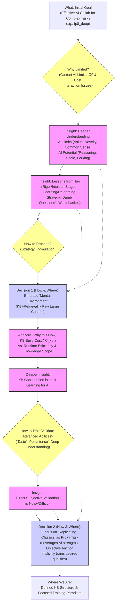

# AI Agent 协作知识库索引

本知识库旨在结构化地记录与 AI Agent（尤其是学者模式下）协作的最佳实践、原则、能力、局限性以及理想的协作模式。

## 核心知识领域 (可视化)

## 核心知识领域 (列表)

*   **[01 原则 (Principles)](./01_principles.md):** 指导协作与开发的基本原则。
*   **[02 AI 能力 (AI Capabilities)](./02_ai_capabilities.md):** AI Agent 的核心能力、潜力与独特优势。
*   **[03 AI 局限 (AI Limitations)](./03_ai_limitations.md):** AI Agent 的根本性局限与挑战。
*   **[04 协作模式 (Collaboration Model)](./04_collaboration_model.md):** 人机协作的最佳实践、角色定义与理想工作流。
*   **[05 项目上下文 (Project Context)](./05_project_context.md):** (可选) 特定项目相关的背景、决策记录与风险评估。
*   **[06 可验证任务 (Verifiable Tasks)](./06_verifiable_tasks.md):** (可选) 用于验证知识应用的任务模板或案例研究。
*   **[经典文献 (Classical Texts)](./classical_texts/):** 包含《孙子兵法》、《庖丁解牛》、《中庸》、《大学》等原文。
*   **[misc (杂项/外部洞见)](./misc/):** 如 Terence Tao 思想总结等。 

