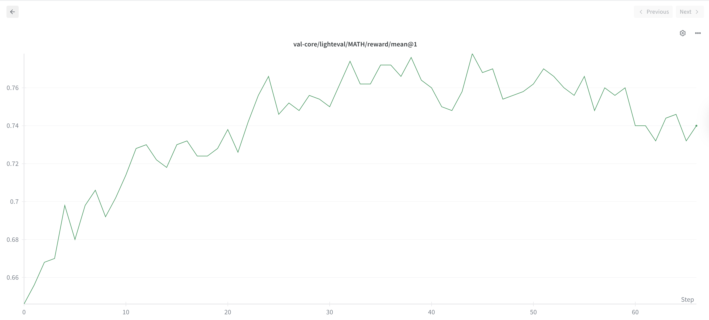

### What does this PR do?

> Adds a new recipe to perform GRPO with full weight-updates on 1.5B models.

### Checklist Before Starting

- [X] Search for similar PRs. Paste at least one query link here: https://github.com/volcengine/verl/pull/3029
- [X] Format the PR title as `[recipe, hardware] feat: Add GRPO with full weight updates for 1.5B models on a single GPU ` (This will be checked by the CI)
  - `{modules}`: `recipe`, `hardware`
  - `{type}`: `feat`
  - No breaking API changes

### Test

> Pass@1 for MATH500: 77.8

### Checklist Before Submitting

> [!IMPORTANT]
> Please check all the following items before requesting a review, otherwise the reviewer might deprioritize this PR for review.

- [X] Read the [Contribute Guide](https://github.com/volcengine/verl/blob/main/CONTRIBUTING.md).
- [X] Apply [pre-commit checks](https://github.com/volcengine/verl/blob/main/CONTRIBUTING.md#code-linting-and-formatting): `pre-commit install && pre-commit run --all-files --show-diff-on-failure --color=always`
- [X] Add / Update [the documentation](https://github.com/volcengine/verl/tree/main/docs).
- [X] Add unit or end-to-end test(s) to [the CI workflow](https://github.com/volcengine/verl/tree/main/.github/workflows) to cover all the code. If not feasible, explain why: ...
- [X] Once your PR is ready for CI, send a message in [the `ci-request` channel](https://verl-project.slack.com/archives/C091TCESWB1) in [the `verl` Slack workspace](https://join.slack.com/t/verl-project/shared_invite/zt-3855yhg8g-CTkqXu~hKojPCmo7k_yXTQ). (If not accessible, please try [the Feishu group (飞书群)](https://applink.larkoffice.com/client/chat/chatter/add_by_link?link_token=772jd4f1-cd91-441e-a820-498c6614126a).)
