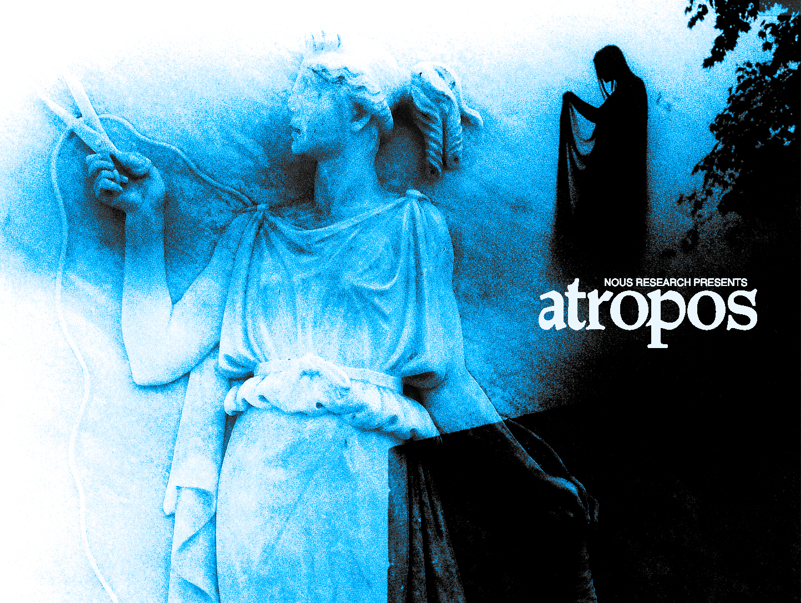

# Atropos - Nous Research's LLM RL Gym



<div align="center">

*In Greek mythology, Atropos was the eldest of the three Fates.  While her sisters spun and measured the threads of mortal lives, Atropos alone held the shears that would cut these threads, determining the final destiny of each soul. Just as Atropos guided souls to their ultimate fate, this system guides language models toward their optimal potential through reinforcement learning.*

</div>

<div align="center">
</div>
<div id="badges" align="center">
  <a href="https://huggingface.co/NousResearch">
    
  </a>
  <a href="https://nousresearch.com">
    
  </a>
  <a href="https://x.com/NousResearch">
    
  </a>
</div>

---

## What is Atropos?
Atropos is an environment microservice framework for async RL with LLMs.

Atropos encompasses both environments, which are set up as services, and a trajectory API for the environments to send data to and for the trainer to pull batches from.


<div align="center">

  *Here is a diagram of how Atropos' components can interact with a trainer & inference server to complete the RL loop (trainer & inference engine not included with the atropos package)*

</div>

Atropos is a robust, scalable framework for **Reinforcement Learning Environments with LLMs**. Key features:

- **Multi-Turn & Asynchronous RL:** Efficiently supports complex, multi-turn, and asynchronous interactions, decoupling environment steps from policy updates.
- **Inference Agnostic:** Integrates with standard inference APIs (e.g., OpenAI, vLLM, SGLang), enabling easy switching between LLM providers and frameworks.
- **Trainer Independent:** Offers a standardized training interface for experimenting with different RL algorithms and frameworks without major code changes.
- **Scalable & Decentralized:** Easily scale by launching more environment instances (locally or across decentralized resources) that contribute rollouts to a central service.
- **Diverse Environment Integration:** Manages many varied environment types concurrently for heterogeneous, multi-modal training.

The goal: provide a flexible, scalable, and standardized platform to accelerate LLM-based RL research across diverse, interactive settings.

The framework supports collecting, distributing and evaluating LLM trajectories through diverse environments including:

<div align="center">

| Environment Type          | Examples                                   | Purpose                                            |
|---------------------------|--------------------------------------------|----------------------------------------------------|
| 📚 Dataset environments   | GSM8K, MMLU, Custom HF Datasets            | Evaluate and improve LLM performance on static data|
| 🎮 Online environments    | Blackjack, Taxi, Text-based games          | Train LLMs through interactive game-based learning |
| 🤖 RLAIF and RLHF         | LLM Judge/Reward Models                    | Fine-tune LLMs using human feedback and alignment  |
| 🔄 Multi-Turn RL          | deepresearch, internal tool calling        | Train LLMs on complex multi-step interactions      |
| 💻 Code Execution         | MBPP, HumanEval (via `coding_server.py`)   | Train LLMs to generate and execute code            |
| 🖼️ Multimodal             | OCR VQA, Clevr (via `multimodal_dpo/`)     | Train LLMs on tasks involving vision and language  |

</div>

## 🎉 Upcoming Atropos Hackathon: LLM RL Environments

Join us in San Francisco on May 18th, 2025 for an exciting hackathon focused on building and experimenting with LLM RL Environments! This in-person event will bring together researchers and developers interested in advancing the field of LLM reinforcement learning.

More details coming soon! Follow us on Twitter [@NousResearch](https://x.com/NousResearch) to stay updated.


---

## Experimental results from models trained using Atropos' environments

We have been able to achieve significant improvements on specific domains or tasks with Atropos - Below are some of the results.

**Tool Calling Environment Results:**

<div align="center">

| Berkeley Function Calling Benchmark Type | Base Model | With Atropos RL | Improvement |
|---------------|------------|-----------------|-------------|
| Parallel Tasks| 10%        | 46%            | **4.6x** ⬆️ |
| Simple Tasks  | 21%        | 51.75%         | **2.5x** ⬆️ |

</div>

Model Artifact:
https://huggingface.co/NousResearch/DeepHermes-ToolCalling-Specialist-Atropos


Environment Used:
[https://github.com/NousResearch/Atropos/environments/tool_calling_server.py](https://github.com/NousResearch/atropos/blob/main/environments/tool_calling_server.py)

---

**Financial Fundamentals Prediction Environment Results**:

<div align="center">

| Metric | Initial Accuracy | With Atropos RL | Improvement |
|--------|-----------------|-----------------|-------------|
| Directional Prediction Eval Accuracy | 20% | 50% | **2.5x** 📈 |

</div>

Model Artifact:
https://huggingface.co/NousResearch/DeepHermes-Financial-Fundamentals-Prediction-Specialist-Atropos

Environment Used:
[https://github.com/NousResearch/Atropos/environments/fundamental_prediction_environment.py](https://github.com/NousResearch/atropos/blob/main/environments/fundamental_prediction_environment.py)

---

## RLAIF Experiment Artifacts
Using the RLAIF Environment to change the personality of the model, we have produced several artifacts of interesting and weird personalities.

**DeepHermes Egregore v1 and v2 8B:**

https://huggingface.co/NousResearch/DeepHermes-Egregore-v1-RLAIF-8b-Atropos
https://huggingface.co/NousResearch/DeepHermes-Egregore-v2-RLAIF-8b-Atropos

**DeepHermes Ascension Maze 8B:**

https://huggingface.co/NousResearch/DeepHermes-AscensionMaze-RLAIF-8b-Atropos

Environment Used: [https://github.com/NousResearch/atropos/blob/main/environments/rlaif_server.py](https://github.com/NousResearch/atropos/blob/main/environments/rlaif_server.py)

---

## Navigating the Repo

| Category | Description |
|----------|------------|
| 📁 [`atroposlib/`](atroposlib/) | Core library containing base classes and utilities |
| 🎮 [`environments/`](environments/) | Collection of ready-to-use RL environments. Community contributions are typically placed in the [`environments/community/`](environments/community/) subdirectory. |
| 📚 [`example_trainer/`](example_trainer/) | Example training scripts and configurations |

Key Documents:
- [Base Environment Class](atroposlib/envs/README.md) - Documentation for creating custom environments
- [Environments Overview and Contribution Guide](environments/community/README.md) - Documentation for existing environments and how to contribute new ones.
- [Full Environment Config Options](CONFIG.md) - Documentation for creating custom environments
- [Example Trainer](example_trainer/README.md) - Getting started with training
- [Slurm Guide](SLURM.md) - Guide for using Atropos with Slurm for distributed inference
- [Frequently Asked Questions (FAQ)](atroposlib/FAQ.md) - Answers to common questions for new users
- [Contributing Guide](CONTRIBUTING.md) - Guidelines for contributors
- [License](LICENSE) - MIT license details

---

## Installation

Get your Python 3.10 (or later) environment ready, then simply pip install:

```bash
pip install atroposlib
```

If you're looking to get into developing the repo or using the environments:


```bash
pip install -e .                # for using
pip install -e .[dev]           # for development
pip install -e .[examples]      # for running examples
pip install -e .[all]           # for everything
```

**Important:** If you're committing to the repository, please install the pre-commit hooks:
```bash
pre-commit install
```

---

### Quick Start Guide

1. **Create Your First Environment**
   - Review our [Base Class Documentation](atroposlib/envs/README.md) to understand the core concepts
   - Check out existing environments in the [`environments/`](environments) directory for examples

2. **Run an Example Environment**

  You should edit the config_init section of the environment file you want ([For example, in GSM8K Environment](https://github.com/NousResearch/atropos/blob/main/environments/gsm8k_server.py#L53)) to point to a running VLLM or SGLang inference server as well as any other [configuration changes](CONFIG.md) you'd like to make, such as the group size, then:

   ```bash
   # Start the API server
   run-api
   ```
   In a separate terminal, start the GSM8K environment microservice
   ```bash
   python environments/gsm8k_server.py serve --openai.model_name Qwen/Qwen2.5-1.5B-Instruct --slurm false
   # alternatively
   # python environments/gsm8k_server.py serve --config environments/configs/example.yaml
   # python environments/gsm8k_server.py serve --config environments/configs/example.yaml --env.group_size 8 # cli args override corresponding config settings
   ```
3. **Grabbing Rollouts**

  If you want to just start getting rollouts, and not use a trainer, see the [debug section](#testing-and-debugging-tools)
  for help getting started with the available tools, we recommend starting with process or view-run

4. **Training Your Model**
   - Follow our [training example guide](example_trainer/README.md) for detailed instructions
   - Monitor progress through our built-in logging and reporting system:
     - Completion lengths
     - Evaluation accuracies
     - Full rollouts and scores

You can use multiple environments at once, just point them all to the same server.

Environments come with detailed logging and reporting support, runs track completion lengths, eval accuracies, full rollouts and scores, and more:


---

# Trainer Integrations
## Axolotl
<a href="https://github.com/axolotl-ai-cloud/plugin-atropos">
  
</a>

Axolotl is a powerful tool for fine-tuning a wide range of AI models, supporting techniques like LoRA and QLoRA through simple YAML configurations.

The [Atropos plugin for Axolotl](https://github.com/axolotl-ai-cloud/plugin-atropos) seamlessly integrates Atropos' RL environments into Axolotl's training pipelines.
This allows you to leverage Atropos for reinforcement learning while utilizing Axolotl's extensive features for model fine-tuning.

To use, follow the readme on the [plugin repository](https://github.com/axolotl-ai-cloud/plugin-atropos).

## Atropos' Example Trainer
Atropos repo contains an example trainer that should primarily be used as a reference example to show how a trainer and inference provider can be integrated with Atropos to complete the RL Training Loop.

To use the example trainer, see this page: [training example guide](example_trainer/README.md)

---

## Testing and Debugging Tools

The trajectory-handler provides several debugging tools to help environment developers test and understand their environments locally without requiring the full distributed infrastructure.

*   **Flexible Model Provider Support:** Atropos natively supports any model provider that adheres to the OpenAI API standard. Simply provide the provider's base URL and your API key, and Atropos can integrate with their models seamlessly for testing or running environments locally.

After launching the API and your selected environments (e.g. `run-api & python environments/gsm8k_server.py serve`), you are then able to view them to get a quick look, or try to prepare some datasets for some offline training:

*   **View Run (`view-run`):** Launch a Gradio UI to inspect batches of rollouts generated by your environment runs. This is useful for visually debugging the interactions and data flow.
*   **Offline Data Generation:** Use `atropos-sft-gen` and `atropos-dpo-gen` to collect rollouts from environments and convert them into formats suitable for Supervised Fine-Tuning (SFT) or Direct Preference Optimization (DPO).

### In-depth Local Environment Analysis with `process`

For developers looking to inspect and debug a single environment without the overhead of the `run-api` server or a full training loop, Atropos environments offer a `process` subcommand. This mode performs inference-only rollouts, meaning it runs your model within the environment to generate interactions, but does not perform any model training or updates.

The `process` subcommand executes the environment's full data pipeline:

1.  **Generation:** Produces model responses based on inputs from the environment.
2.  **Parsing:** Processes these raw model outputs into a structured format.
3.  **Scoring:** Applies the environment's reward logic to evaluate the quality of the generated responses.

**Outputs and Visualization:**

When you specify a path to save the generated data using the `--env.data_path_to_save_groups your_output_file.jsonl` argument (or a similar argument defined by the specific environment, check with `--help`), the `process` command provides several benefits:

*   **JSONL Output:** Saves all generated rollout groups, including prompts, responses, and scores, to the specified `.jsonl` file. This data can be useful for detailed offline analysis and debugging.
*   **Static HTML Visualization:** Automatically generates a corresponding `.html` file (e.g., `your_output_file.html`) that provides a user-friendly, browser-based view of the rollouts contained in the JSONL file. This is excellent for quickly understanding model behavior and identifying issues.
*   **WandB Logging:** If Weights & Biases (`use_wandb=True`) is enabled in your environment's configuration, the `process` subcommand will also log the run data, metrics, and generated rollouts to your WandB dashboard, allowing for persistent tracking and comparison even for these inference-only runs.

**Example Usage:**

To run the `process` subcommand for an environment like `gsm8k_server.py` and save the outputs:

```sh
python environments/gsm8k_server.py process --env.data_path_to_save_groups gsm8k_rollouts.jsonl
```

This will create `gsm8k_rollouts.jsonl` and `gsm8k_rollouts.html`.

**Customization:**

You can customize the inference endpoint and other parameters for the `process` subcommand. For example, to use a different model or API endpoint:

```sh
python environments/gsm8k_server.py process \
  --env.data_path_to_save_groups gsm8k_rollouts.jsonl \
  --env.my_custom_field "value" \
  --openai.base_url https://your-custom-api-url/v1 \
  --openai.api_key YOUR_API_KEY \
  --openai.model_name your_model_identifier
```

You can add custom fields to the `env` namespace by returning a custom subclass of BaseEnvConfig in `config_init` [[example](https://github.com/NousResearch/atropos/blob/bdb15e5d85ddcf8a6ede352977719df442e60a22/environments/math_server.py#L181)].

Always refer to the specific environment script's help for all available options:

```sh
python environments/your_environment_script.py process --help
```

### Offline Data Generation Quick Start

Run the below in separate terminals:
```sh
run-api
```
```sh
python gsm8k_server.py serve --slurm False # or an env of your choice
```
```sh
atropos-sft-gen path/to/output.jsonl --tokenizer Qwen/Qwen2.5-1.5B-Instruct # or whichever tokenizer you have in your env config
```
Rejection sampling can be controlled via `--save-top-n-per-group`, `--allow-negative-scores`, and `--minimum-score-diff-max-min`. See `atropos-sft-gen -h` for more detailed usage info.

If you would like to use OpenAI models, please edit your `config_init` to something like the following:
```python
    @classmethod
    def config_init(cls) -> Tuple[BaseEnvConfig, List[APIServerConfig]]:
        env_config = BaseEnvConfig(
            tokenizer_name="Qwen/Qwen2.5-1.5B-Instruct",
            group_size=8,
            use_wandb=True,
            rollout_server_url="http://localhost:8000",
            total_steps=1000,
            batch_size=12,
            steps_per_eval=100,
            max_token_length=2048,
            wandb_name="gsm8k",
        )
        server_configs = [
            APIServerConfig(
                model_name="gpt-4.1-nano",
                base_url=None,
                api_key=os.environ.get("OPENAI_API_KEY"),
                num_requests_for_eval=256,
            ),
        ]

        return env_config, server_configs
```

For DPO, replace `atropos-sft-gen` with `atropos-dpo-gen` and check `atropos-dpo-gen -h` for data filtering and saving options.

---

## Citation

If you have found the library helpful in your work, you can cite this repository as:

```latex
@misc{atropos,
  title = {{Atropos - An Async First Environment Rollout Controller}},
  author = {Dakota Mahan, Roger Jin, Teknium, Shannon Sands, Artem Yatsenko, Jai Suphavadeeprasit, Karan Malhotra, Chen Guang, Joe Li},
  url = {https://www.github.com/NousResearch/Atropos},
  month = {4},
  year = {2025},
  version = {0.1},
}
```

---

## Contributing

Atropos is built by the open-source AI community, and relies on our amazing contributors! Please see our [contributing](CONTRIBUTING.md) guide for more details on our code formatting, testing, etc.
Please follow the [Code of Conduct](CODE_OF_CONDUCT.md).

---

## License
Atropos is uses the MIT license, see the [LICENSE](LICENSE) file here for more information
