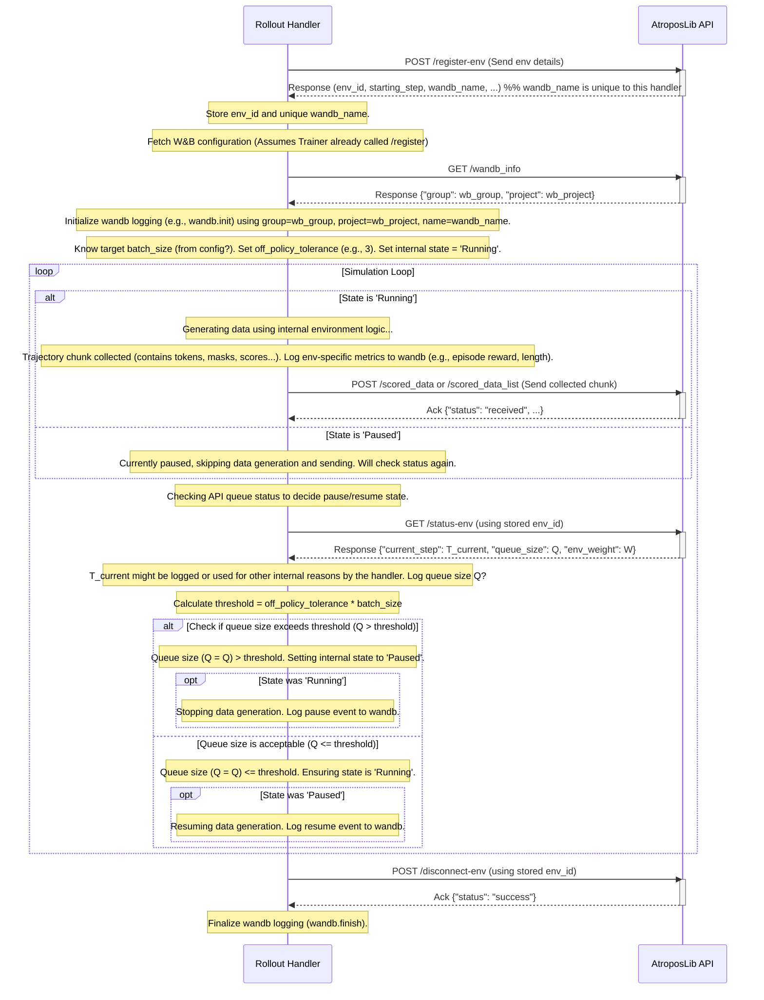

```mermaid
sequenceDiagram
    participant RH as Rollout Handler
    participant API as AtroposLib API

    %% --- Initialization ---
    RH->>API: POST /register-env (Send env details)
    activate API
    API-->>RH: Response (env_id, starting_step, wandb_name, ...)  %% wandb_name is unique to this handler
    deactivate API
    Note over RH: Store env_id and unique wandb_name.

    Note over RH: Fetch W&B configuration (Assumes Trainer already called /register)
    RH->>API: GET /wandb_info
    activate API
    API-->>RH: Response {"group": wb_group, "project": wb_project}
    deactivate API
    Note over RH: Initialize wandb logging (e.g., wandb.init) using group=wb_group, project=wb_project, name=wandb_name.

    Note over RH: Know target batch_size (from config?). Set off_policy_tolerance (e.g., 3). Set internal state = 'Running'.

    loop Simulation Loop

        %% --- Check Pause State & Generate/Send Data ---
        alt State is 'Running'
            Note over RH: Generating data using internal environment logic...
            %% (Internal simulation steps, action selection, etc., happen here - details are opaque to the API)
            Note over RH: Trajectory chunk collected (contains tokens, masks, scores...). Log env-specific metrics to wandb (e.g., episode reward, length).

            %% --- Send Data ---
            RH->>API: POST /scored_data or /scored_data_list (Send collected chunk)
            activate API
            API-->>RH: Ack {"status": "received", ...}
            deactivate API
        else State is 'Paused'
             Note over RH: Currently paused, skipping data generation and sending. Will check status again.
             %% Implement delay/sleep here to avoid busy-checking status when paused
        end


        %% --- Periodic Queue Size Check (Pause/Resume Logic) ---
        Note over RH: Checking API queue status to decide pause/resume state.
        RH->>API: GET /status-env (using stored env_id)
        activate API
        API-->>RH: Response {"current_step": T_current, "queue_size": Q, "env_weight": W}
        deactivate API
        Note over RH: T_current might be logged or used for other internal reasons by the handler. Log queue size Q?

        Note over RH: Calculate threshold = off_policy_tolerance * batch_size
        alt Check if queue size exceeds threshold (Q > threshold)
            Note over RH: Queue size (Q = Q) > threshold. Setting internal state to 'Paused'.
            opt State was 'Running'
                 Note over RH: Stopping data generation. Log pause event to wandb.
            end
        else Queue size is acceptable (Q <= threshold)
            Note over RH: Queue size (Q = Q) <= threshold. Ensuring state is 'Running'.
            opt State was 'Paused'
                Note over RH: Resuming data generation. Log resume event to wandb.
            end
        end

    end %% End Simulation Loop

    %% --- Optional Shutdown ---
    RH->>API: POST /disconnect-env (using stored env_id)
    activate API
    API-->>RH: Ack {"status": "success"}
    deactivate API
    Note over RH: Finalize wandb logging (wandb.finish).
```
