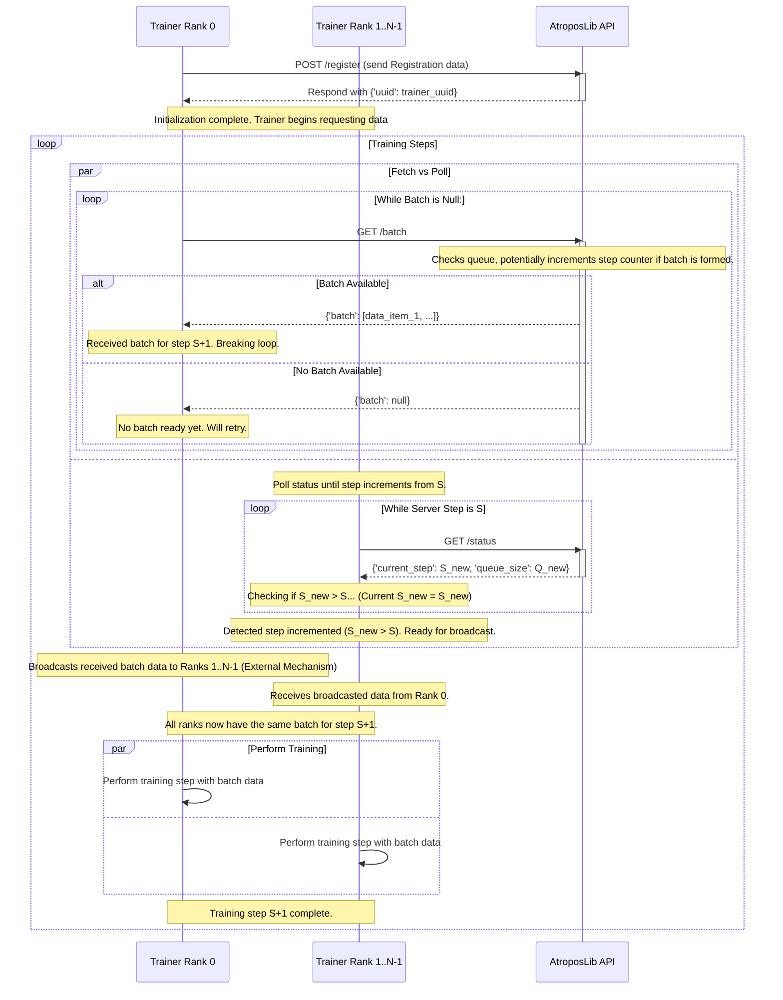

```mermaid
sequenceDiagram
    participant R0 as Trainer Rank 0
    participant R1N as Trainer Rank 1..N-1
    participant API as AtroposLib API

    R0->>API: POST /register (send Registration data)
    activate API
    API-->>R0: Respond with {'uuid': trainer_uuid}
    deactivate API
    Note over R0, R1N: Initialization complete. Trainer begins requesting data

    loop Training Steps
        %% --- Phase 2: Rank 0 fetches batch, others wait/poll ---
        par Fetch vs Poll
            loop While Batch is Null:
                R0->>API: GET /batch
                activate API

                Note over API: Checks queue, potentially increments step counter if batch is formed.

                alt Batch Available
                    API-->>R0: {'batch': [data_item_1, ...]}
                    Note over R0: Received batch for step S+1. Breaking loop.
                else No Batch Available
                    API-->>R0: {'batch': null}
                    Note over R0: No batch ready yet. Will retry.
                end
                deactivate API
            end
        and
            Note over R1N: Poll status until step increments from S.
            loop While Server Step is S
                R1N->>API: GET /status
                activate API
                API-->>R1N: {'current_step': S_new, 'queue_size': Q_new}
                deactivate API
                Note over R1N: Checking if S_new > S... (Current S_new = S_new)
                %% In implementation, add delay here if S_new == S to avoid busy-wait
            end
            Note over R1N: Detected step incremented (S_new > S). Ready for broadcast.
        end

        %% --- Phase 3: Handle result ---
        Note over R0: Broadcasts received batch data to Ranks 1..N-1 (External Mechanism)
        Note over R1N: Receives broadcasted data from Rank 0.
        Note over R0, R1N: All ranks now have the same batch for step S+1.

        %% --- Phase 4: Perform Training Step ---
        par Perform Training
            R0->>R0: Perform training step with batch data
        and
            R1N->>R1N: Perform training step with batch data
        end
        Note over R0, R1N: Training step S+1 complete.

    end # End Training Steps Loop
```
