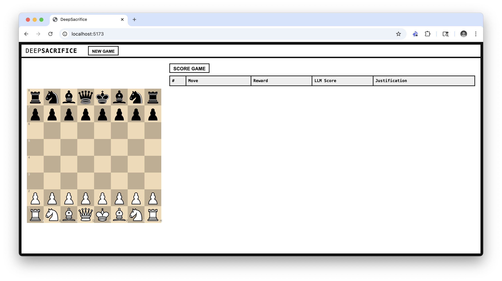
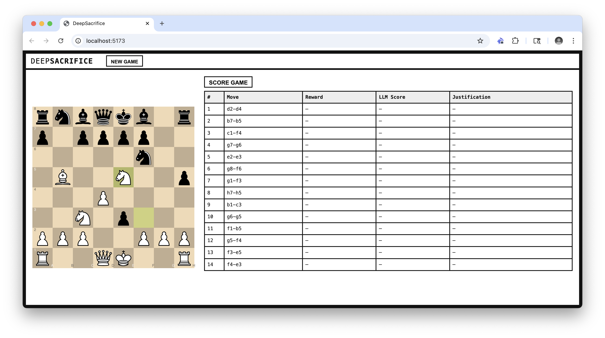
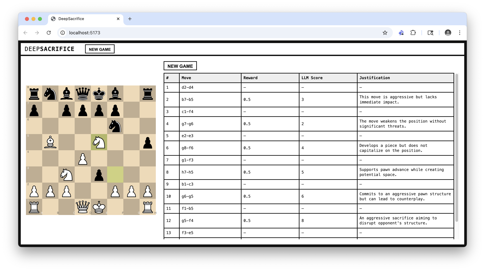
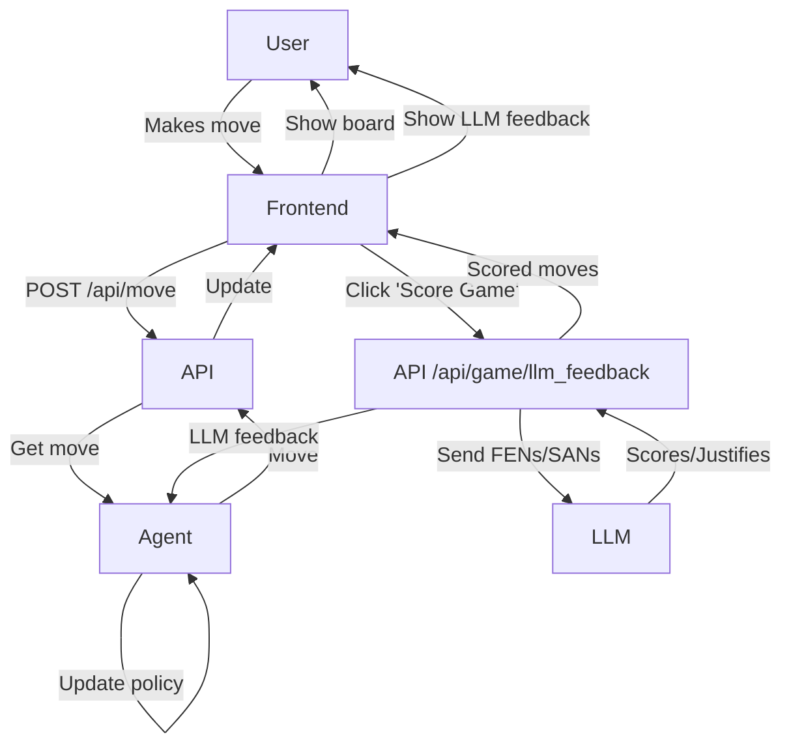

# DeepSacrifice

## Overview

DeepSacrifice is a **design prototype** for a lightweight **reinforcement learning (RL)** loop in a chess environment. The goal is to train an agent to play **aggressive**, **sacrificial**, and **attacking** chess using feedback from **direct human-vs-agent gameplay** and **post-game evaluations** by a language model (LLM).

The idea is that, over time, the agent will adapt its skill level to the user's skill level (and surpass it) while playing exclusively aggressive chess (e.g., sacrificing material for the initiative, attacking the king, luring the opponent to overextend).

---

## Purpose

- **Human-in-the-loop RL**: The user serves as the environment, directly interacting with the agent. Each complete game generates a full **trajectory** (sequence of states and actions), which is scored and used for learning.

- **LLM-based reward model**: The LLM acts as a **reward function**, scoring trajectories for **aggression**, **brilliance**, and **sacrifice justification**. This replaces sparse binary rewards with dense, informative feedback.

- **Policy improvement**: The agent's **policy** (its move-selection strategy) is updated based on **rewards** received at the end of each game, enabling **reinforcement learning** over time.

- **Exploration vs. Exploitation**: The agent balances exploring risky sacrifices versus exploiting known aggressive lines that have yielded high rewards in the past.

---

## Core Concepts

| RL Term              | Implementation in DeepSacrifice                         |
|----------------------|---------------------------------------------------------|
| **State**            | The chess board (FEN) at each ply                      |
| **Action**           | A legal move by the agent (SAN)                        |
| **Trajectory**       | Full game history of states and agent actions          |
| **Reward**           | Post-game score from LLM: aggression, brilliance, win  |
| **Policy**           | Move selection logic (with aggression weighting)       |
| **Learning**         | Heuristic updates to parameters based on reward        |
| **Environment**      | The human player and game loop                         |
| **Episode**          | A single completed chess game                          |

---

## Walkthrough

### 1) Start a new game



### 2) Play against an aggressive chess agent



### 3) Score the game with an LLM



---

## Learning Flow

1. **Game is played**
   The agent and user alternate actions in the chess environment. The episode ends when the game is complete.

2. **Trajectory is recorded**
   Log the full sequence of states (FENs) and agent actions (SANs), including sacrificial decisions and the final outcome (win/draw/loss).

3. **LLM evaluates the trajectory**
   After the episode, the trajectory is passed to an LLM, which provides dense feedback using a structured prompt:

   > "Given the following chess game FEN history and SAN moves, evaluate each agent move for aggression/brilliance and sacrifice justification. Return a JSON array of scores and justifications."

4. **Reward is computed**
   The LLM scores are aggregated into a **scalar reward** using a weighted formula, incorporating:
   - Aggression
   - Brilliance
   - Game outcome

5. **Policy is updated**
   Based on the final reward, the agent performs **policy improvement** by adjusting its internal parameters:
   - Aggression threshold
   - Sacrifice prioritization
   - Move ordering or evaluation heuristics

6. **Next episode begins**
   The updated policy is used in the next game against the user, completing the **reinforcement loop**.

---

## Data Flow



---

## Setup & Install

### Prerequisites

- [Bun](https://bun.sh/) (package management, runtime)
- [OpenAI API key](https://platform.openai.com/account/api-keys)

### Environment Setup

1. Copy the example environment file:
   ```sh
   cp .env.template .env
   ```
2. Open `.env` and input your OpenAI API key for `OPENAI_API_KEY`.

### Install dependencies

```sh
bun install
```

Now, open two terminals and run the following commands:

### Run the frontend

```sh
bun dev
```

### Run the backend

```sh
bun dev:server
```
