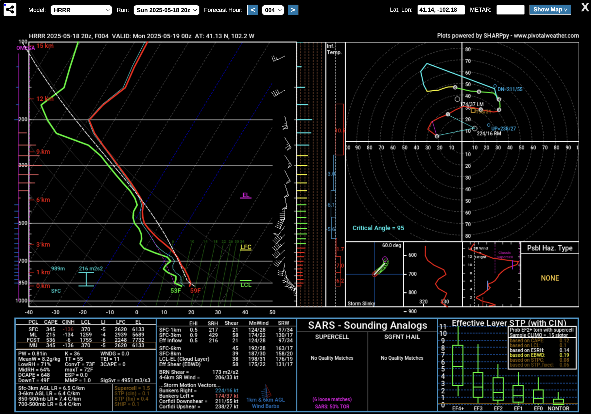

# MeteorologyForecastRL

## Environment Design & Motivation

**MeteorologyForecastRL** is a reinforcement learning environment designed to train LLMs on interpreting numerical weather prediction (NWP) model sounding data and making informed forecast assessments. The core idea is to move beyond static graphical outputs (e.g., SHARPpy-style skew-Ts or hodographs) and into a **text-structured, LLM-readable format** that enables programmatic reasoning and analysis.




The system enables generation of **thousands of location-specific model soundings per model run**, allowing the agent to learn over a broad variety of scenarios. Each sounding is paired with a structured prompt guiding the LLM to:

1. **Analyze the sounding data** in detail.
2. **Call conceptual tools** (e.g., radar, satellite, surface obs) when needed to supplement understanding.
3. **Generate a final forecast summary** for a specific place and time.

A separate judge LLM evaluates the agent's reasoning, tool usage, and forecast quality. This setup allows for reinforcement learning via fine-grained feedback, driving the agent to improve not only its predictive accuracy but also its decision-making process regarding when and how to seek additional information.

The long-term vision is a model that can:

* Autonomously retrieve, interpret, and integrate real-time observational data.
* Learn to make high-quality, custom forecasts at arbitrary geographic points.
* Serve as an assistant or augmentation tool for meteorologists, enhancing situational awareness during severe weather.


## Quickstart

### Requirements

* Python 3.10+
* Install dependencies:

```bash
pip install -r requirements.txt  # or manually install atroposlib, wandb, httpx, etc.
```

### Running the Environment

To start the CLI interface with your configuration:

```bash
python meteorology_forecast_env.py serve \
  --env.group_size 2 \
  --env.use_wandb True \
  --env.sounding_data_root /path/to/data \
  --env.target_date 20250314 \
  --openai.api_key $AGENT_LLM_API_KEY \
  --openai.base_url http://localhost:8080/v1 \
  --openai.model_name Qwen/Qwen3-8B \
  --env.judge_model_name google/gemini-2.5-flash-preview \
  --env.judge_api_key_env_var OPENROUTER_API_KEY
```

You must have sounding data in the expected format under:

```
/path/to/data/YYYYMMDD/{location_id}/
  - {location_id}_{model}_{timestamp}.jsonl
  - AFD_*.txt
```

### Example Run:

```bash
python meteorology_forecast_env.py serve
```

Use CLI flags or env vars to configure models and API keys.

## Weights & Biases Run + Metrics

[📊 View the example run here](https://wandb.ai/fahrenheitagi-fahrenheitagi/my_atropos_rl_experiments/runs/dsubhw9i/overview)

We track the following metrics during training and evaluation:

* `train/avg_judge_total_score`: Overall forecast quality (0–10 scale).
* `train/avg_judge_reasoning_score`: Depth and accuracy of the agent's reasoning (0–5).
* `train/avg_judge_tool_score`: Tool usage relevance (0–3).
* `train/avg_judge_forecast_score`: Forecast clarity and alignment (0–2).
* `train/detailed_rollouts`: W\&B table logging prompts, reasoning, tool calls, summaries, and justifications.

These metrics give insight into whether the model is improving in forecast thinking, tool invocation, and summarization quality. Evaluation runs reuse these metrics to track generalization to unseen cases.

---

This project demonstrates how reinforcement learning with LLMs can be used in domain-specific, multi-step reasoning environments using real structured data and expert scoring criteria.
