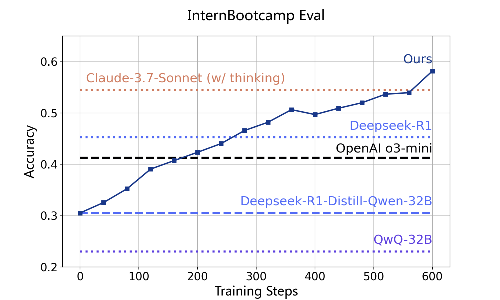
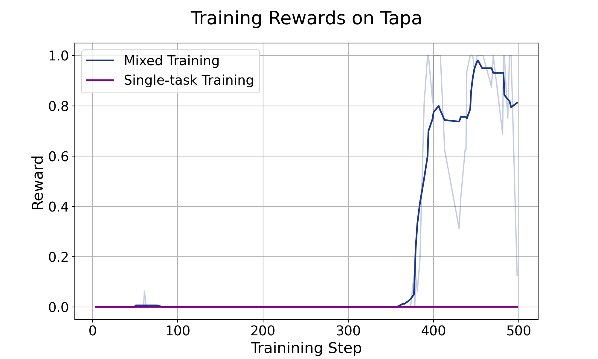

# Internbootcamp

English | [中文](./README_zh.md) 

<p align="center">
 
</p>


Internbootcamp is an easy-to-use and extensible library of bootcamp environments for training large reasoning models. By integrating **a comprehensive collection of verifiable tasks with unlimited automatic question generation and result verification**, Internbootcamp aims to provide data that enhances reasoning capabilities and their generalizability across diverse scenarios. Currently, Internbootcamp includes over one thousand verifiable reasoning tasks, covering problems related to logic, puzzles, algorithms, games, and more. We are continuing efforts to expand its scope with the community.

## Getting Started

* [Installation](#section3)
* [Interfaces and Usages](#section4)


## Update

[2025/04] v0.1 released.

## 1 About

Large-scale reinforcement learning has been demonstrated to be an effective way towards expert-level reasoning models. Most current efforts to advance this technical routine concentrate on limited tasks, such as math, and focus on devising improved training algorithms. Complementary, we believe the investigation into **data** is also necessary for an esteemed reasoning model:
-  We could include more types of tasks to cover more diverse reasoning patterns, to build a more general reasoning model;
-  We could study tasks with more controllable difficulties and their combinations to facilitate our understanding of the training dynamics, to explore more efficient training strategies.

Despite the abundance of potentially valuable tasks available, their dispersed distribution across various sources makes it exceptionally difficult for practitioners to utilize them. To this end, we introduce Internbootcamp to facilitate related investigations and provide engineering convenience. In particular, we would like to highlight the following features of Internbootcamp:
- **Standardized: Internbootcamp provides a unified interface for various tasks and is easy to integrate with different codebases for reinforcement learning or synthetic data.**  In Internbootcamp, we define each task as a bootcamp class, which allows parameters to control the task difficulties. Each bootcamp class implements a unified interface to generate questions and verify the solutions. With the unified interface, tasks in Internbootcamp can be easily combined with codebases for reinforcement learning or synthetic data.
- **Scalable: thanks to an automatic workflow for bootcamp synthesis, InternBootcamp has included a large volume of diverse bootcamp tasks.**  In the first release, InternBootcamp has been covering over 1000 complex reasoning tasks, including various task types such as games, logic problems, puzzles, algorithms, and more. Among these bootcamps, over 96% were developed through an automated workflow for synthesis and quality filtration, enabling the continuous scaling of bootcamp environments with low intervention.
- **Extensible: Internbootcamp can be extended to support more diverse and complicated tasks (e.g., tasks with multiturn interaction like Go and agents) and provide them with question generation and results verification.** Representatively, we include the `InternGObootcamp` as a demonstration.

We also conduct a series of investigations into reinforcement learning using Internbootcamp. Our preliminary findings are as follows:
- As a representative of single-task training, we train `InternThinker-GO` with the InternGObootcamp in Internbootcamp. `InternThinker-GO` approaches professional players using far fewer games than AlphaGO, which surpasses current reasoning models. Besides excellent performance, `InternThinker-GO` can provide reasonable and inspiring thoughts, demonstrating the great potential of human-like reasoning, empowered with reinforcement learning, in tackling expert-level tasks.
- Besides, mixing the bootcamps together, we find that there remains a large room for current reasoning models to improve in bootcamp tasks, but reinforcement learning can effectively improve their performance. Through training on merely 22k prompts mixed with all verified tasks, the outcome models successfully improve by 27% based on `Deepseek-R1-Distill-Qwen-32B`, surpassing frontier reasoning models like `Claude-3.7-Sonnet` and `Deepseek-R1`, and continually improves with more training steps.
- Noteworthy, reinforcement learning on bootcamp tasks can even lead to consistent improvement in benchmarks for general reasoning, such as expert knowledge, math, and coding. Moreover, in multitask training, we find that the generalization across tasks brings the "emerging moment" when some challenging task that fails to improve in single-task training succeeds to be learnt in mixed training, unveiling the potential benefits of scaling training tasks.

## 2 Supported bootcamps<a id="section2"></a>

In the first release, Internbootcamp has covered bootcamps for 1060 tasks, coming from:
- **Benchmarks for reasoning.** Currently, we have included tasks from [ARC-AGI](https://github.com/fchollet/ARC-AGI), [KOR-Bench](https://kor-bench.github.io/), and [BBEH](https://github.com/google-deepmind/bbeh), three representative reasoning benchmarks, to build bootcamps. Here, KOR-Bench includes five types of reasoning tasks, namly logic, operation, cipher, puzzle, and counterfactual reasoning, where we neglect counterfactual reasoning for its dependance on specific world-view knowledge and build bootcamps for the remaining four types of tasks. BBEH is 23 reasoning tasks obtained by complicating tasks from BBH, and we build bootcamps for tasks do not depend on external knowledge.
- **Puzzle websites.** [puzzle-xxx](https://www.puzzle-aquarium.com/) is a series of webpages of puzzles, we scratch 39 puzzles on it to prepare corresponding bootcamps.
- **Algorithm problems.** Algorithm problems cover reasoning patterns in various algorithms, and they contain questions that are close to real-world applications. Meanwhile, algorithm problems in the wild usually contain reference solutions, making it easy to convert them into bootcamps. Currently, we use [CodeContests](https://huggingface.co/datasets/deepmind/code_contests) and select 1265 tasks with medium difficulties (codeforces points between 1000 and 2000) and apply our automatic workflow to construct corresponding bootcamps. Additionally, we adapted tasks from [CodeIO](https://codei-o.github.io/), which translates code-based reasoning into natural language to assess large language models' reasoning capabilities.
- **Benchmarks for programming capabiltiy.** Currently we have included tasks from [BigCodeBench](https://bigcode-bench.github.io/) and [KodCode](https://kodcode-ai.github.io/), two representative programming benchmarks, to build bootcamps. These benchmarks feature diverse and challenging problems that require language models to generate correct code. For each task, we collected or adapted a `unittest` script to validate solution correctness.
- **Instruction following.** These tasks test a model's ability to comprehend and strictly adhere to instructions embedded in task descriptions. In many cases, correctness can be evaluated through code execution feedback. We included tasks from [AutoIF](https://github.com/QwenLM/AutoIF), which contains over 60,000 instruction–evaluation function pairs, each treated as an individual task.
- **Games.** Games are a kind of complex reasoning tasks involving multiturn interactions featuring controllable and verifiable objectives. As a representative, we built `InternGObootcamp` to train a reasoning model for Go.

Among all the bootcamps, 84 of them are implemented or verified by human programmers, 978 are produced with an automatic workflow, and there are also 2 bootcamps under development for special purposes. 

We are continuing our efforts and call for the community to verify the automatically generated bootcamps. We present the full list of bootcamps ([the full bootcamp list](./Fulllist_InternBootcamp.md))and illustrate our automatic workflow below.
For specific purposes, we design Arcbootcamp，KORbootcamp、BBEHbootcamp and InternGobootcamp.
Here, Arcbootcamp serves for optimizing performance on [ARC-AGI](https://github.com/fchollet/ARC-AGI). To develop this bootcamp, we largely refer to the implementation in [michaelhodel/re-arc](https://github.com/michaelhodel/re-arc).

### bootcamps from Automatic Workflow
A vast number of tasks can be built into bootcamps. Writing bootcamp code for each task manually is hugely inefficient and hardly scalable. To this end, we introduce an automated workflow that leverages the increasingly mature code generation capabilities of large language models to generate bootcamp code from task descriptions to achieve large-scale bootcamp construction. This process consists of three stages: (1) Task Description Collection; (2) Code Generation; (3) bootcamp Validation and Filtering. 

The full list of bootcamps generated by an automatic workflow can be found in [the full bootcamp list](./Fulllist_InternBootcamp.md).  We illustrate the details of the automatic workflow as follows.

<p align="center">
 
</p>

**Collecting Task Descriptions:** First, we identify a series of tasks whose questions can be automatically generated and verified. These include, but are not limited to: (1) Puzzles, such as those from the puzzle-xxx websites; (2) Benchmarks for reasoning, like ARC-AGI, KOR, and BBEH; (3) Algorithm problems, which can be solved by specific algorithms and whose problem statements resemble real-world application problems. We collect descriptions of these problems and any available supporting information, such as sample questions, example solution programs, etc., to constitute the task description.

**Code Generation:** We utilize frontier coding models, e.g., Deepseek-R1, to generate the codes of the bootcamps. We provide the model with the required interfaces with their descriptions, along with the task descriptions collected in the previous step. The model then synthesizes the bootcamp code. In early attempts, we found that some model-synthesized code suffered from issues like oversimplification or runtime errors. To address this, we adopted a multi-round synthesis approach. After each round of synthesizing bootcamp code, we feed the code's runtime results back to the model for further rounds of generation. We also sample multiple times in parallel for each task to ensure the success rate.

**bootcamp Validation and Filtering:** For the generated bootcamp code, we designed a testing procedure to ensure the code can run correctly for large-scale data generation and result validation. Specifically, we sample questions with synthetic bootcamps and test the score achieved by reasoning LLMs, also using the verification codes generated. Based on the program's execution results and evaluated scores, we exclude bootcamp environments that contain obvious errors (e.g., execution errors or scored 0) or are overly simplified (accuracy close to 1).


## 3 Installation<a id="section3"></a>

```
git clone https://github.com/InternLM/Internbootcamp.git
cd internbootcamp
pip install -e .
```

## 4 Interfaces and Usages<a id="section4"></a>

Each bootcamp inherits from Basebootcamp and contains three main interfaces: `case_generator`, `prompt_func`, and `verify_score`, to serve for question generation and result verification.

<p align="center">
 
</p>

### Example (Game24bootcamp)
We introduce the usage of the bootcamp with `Game24bootcamp` as an example. Other supported bootcamps can be found in [the full bootcamp list](./Fulllist_InternBootcamp.md).

Game24 is a simple arithmetic puzzle where you are given `num_numbers` numbers, each up to a value of `range_max`. The goal is to obtain the `target` value using the four basic arithmetic operations, where the `target` value does not exceed `target_max`.

#### Generating Questions
First, let's instantiate the bootcamp:
```python
from internbootcamp import Game24bootcamp

# You can specify the problem difficulty
bootcamp = Game24bootcamp(num_numbers=4, range_max=100, target_max=100, seed=42)

# You can also use the default parameter configuration
# bootcamp_default = Game24bootcamp()
```

Then, use the `case_generator` interface (method) to generate a problem instance, and use `prompt_func` to convert the instance into a natural language question:

```python
identity = bootcamp.case_generator()
prompt = bootcamp.prompt_func(identity)

# Example Output:
# - identity: {'puzzle': '8 43 65 77', 'target': 28} 
# - prompt: "Please solve the puzzle：using 8 43 65 77 to obtain 28 through basic arithmetics Let's hink step by step and output the final answer within \\boxed{}.The final answer should be all input numbers with basic operations, and parentheses can be used to change the order of operations. For example \"Final Answer: \\boxed{6+6+(6+6)}\"."
```

#### Verifying Results
After obtaining the response to the question, use the `verify_score` interface (method) to score the result. By default, a score of 1 is returned for a correct result, and a score of 0 is returned for an incorrect result. Additionally, you can specify format_score (defaulting to 0), which is the score returned only if the response format is correct.

```python
response = "...some reasoning process...\\boxed{77 / (65 - 43) * 8}"
score = Game24bootcamp.verify_score(response, identity, format_score=0.1)
```

### Extending to More Tasks
Based on the interfaces described above, Internbootcamp can be easily extended with new tasks. See [examples/README.md](examples/README.md) for details.

### Reinforcement Learning
Internbootcamp can be easily integrated into various mainstream reinforcement learning or synthetic data frameworks. See [examples/bootcamp-rl/README.md](examples/xpuyu_usage/README.md) for details.


## 5 Training Reasoning Models with Internbootcamp

Internbootcamp provides training data with infinite quantities, diverse task coverage, and controllable difficulties for training reasoning models. Based on this, we conduct a series of explorations with some preliminary results as follows.

### DEMO: InternThinker-GO
LLMs have demonstrated remarkable performance across a wide range of common reasoning tasks. However, as one of the earliest research problems that ignited the AI boom, the reasoning capabilities of general-purpose LLMs in the specific domain of **Go** have received little research attention. While AlphaZero challenged human intelligence in the Go domain from the perspective of "Mastering the Game of Go without Human Knowledge," we explore how to bring human intelligence back to this ancient game, allowing the natural language thinking patterns unique to humans to shine again in the new context of LLMs. Based on Internbootcamp, we implemented a Go bootcamp for reinforcement learning of reasoning models, cold-started with professional Go domain data, and reinforced the model's reasoning paradigm through reinforcement learning. Our model achieves performance comparable to professional Go players - InternThinker-GO can consistently defeat Golaxy AI at amateur 6-dan level and approaches the professional 1-star level, making it the first general large language model to reach this level of performance.

<p align="center">
 
</p>

For a given state, InternThinker-GO first analyzes the situation on the board: "There is a complex battle area in the upper right corner, where both Black and White have multiple stones. The lower left corner has some interlaced Black and White stones, forming a certain structure. Black has a formation along the left edge. Black just played move 65 at B14, which is clearly intended to invade White's territory on the left side. As White, I need to respond carefully to this threat." Next, InternThinker-GO specifically predicts and analyzes potential moves such as B13, C13, and ultimately selects B13 as the placement position.


### Training with Task Mixing

We train and evaluate our model on a mix of 80 validated bootcamps based on `Deepseek-R1-Distill-Qwen-32B`, using GRPO. Our results show:
- Frontier reasoning models still have a large room for improvement on bootcamp tasks, while reinforcement learning on these tasks is an effective way for this.
- Interestingly, we find models trained on bootcamp tasks also get improvement on general reasoning benchmarks with unseen tasks such as math and professional knowledge QA, unveiling that bootcamp tasks can be effective for improving general reasoning capabilities. 
- Meanwhile, we find training with task mixing fosters the "**emerging moment**", where some tasks that fail to learn alone suddenly gain improvement in mixed training after a certain training step. This demonstrates the potential of scaling training tasks, serving as a kind of implicit curriculum learning, to elicit challenging tasks.
Details are as follows.

**Performance on bootcamp Tasks** We randomly divided the difficulty configurations to generate data for the training and test sets on the validated bootcamps(`examples/data/InternBootcamp_eval`).
<p align="center">
 
</p>

* With the data, we first evaluate the performance of mainstream reasoning models. It shows that these models still have a large room to improve on our bootcamp tasks, and some reasoning models do not show an obvious advantage over their non-reasoning version.
* Accordingly, we study whether we can effectively improve model performance on these bootcamp tasks with reinforcement learning. Specifically, we use the generated training data to train `Deepseek-R1-Distill-Qwen-32B`. With 22k prompts, the accuracy on the test set considerably increases by 27%, surpassing `OpenAI o3-mini`, `Deepseek-R1` and `Claude-3.7-Sonnet`, demonstrating the effectiveness of reinforcement learning in enhancing model ability on these tasks.


||Qwen-32B-Instruct|Deepseek-R1-Distill-Qwen-32B|QwQ-32B|Deepseek-R1|Claude-3.7-Sonnet (w/o thinking)|Claude-3.7-Sonnet (w/ thinking)|OpenAI o3-mini|Ours|
|-|-|-|-|-|-|-|-|-|
|Accuracy on bootcamp Testset (%)| 30.0|30.5|23.0|45.3| 39.2| 54.5|41.3| **58.2**|


**Emerging Moment** Notably, benefiting from intertask generalization, we find that training on a mixture of diverse tasks elicits the performance of challenging tasks that fail to learn when trained alone improves. As demonstrated in the figure, in the Tapa/KorOperationUnicdoe25ce task, the model hardly samples a correct solution, thus failing to learn when trained alone. Nonetheless, its performance gets elicited and then improves after a few steps of mixed training. This demonstrates the potential of scaling training tasks in reinforcement learning to bring implicit curriculum learning for tackling challenging tasks.

<p align="center">
    
</p>


## Citation

If you find our library helpful, please cite
```
@software{Internbootcamp,
  author = {Internbootcamp Team},
  title = {Internbootcamp},
  version = {0.0.4},
  month = {4},
  year = {2025}
}
```
