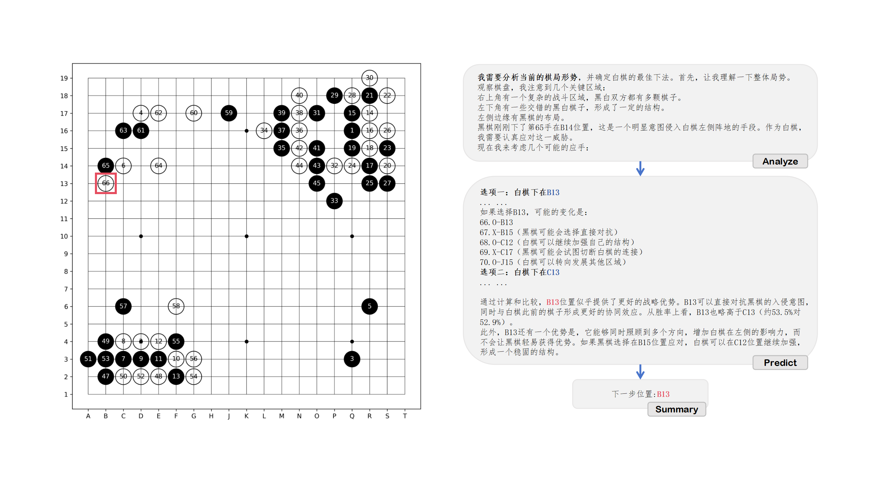
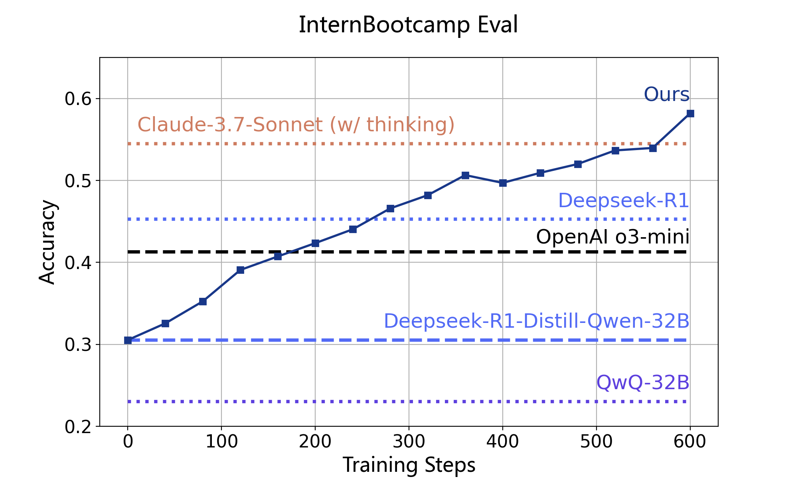
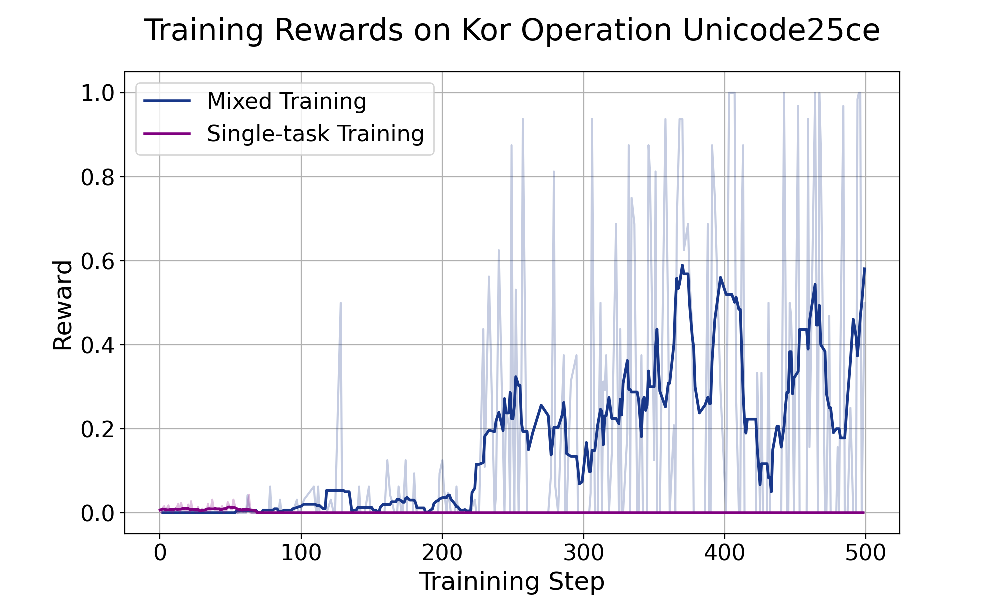

# Internbootcamp

[English](./README.md) | 中文

<p align="center">
 
</p>


Internbootcamp是一个易用、可扩展的推理模型训练训练场环境。通过集成大量可验证的推理任务并为其支持无限量的**自动化问题生成**和**结果验证**，Internbootcamp旨在提供推理形式多样且难度可控的大规模数据资源，以推动大模型在广泛场景下的推理能力提升及泛化。目前，Internbootcamp已集成上千种可验证的、难度可控的推理任务，包含游戏（games）、逻辑问题（logic）、谜题（puzzles）、算法问题（algorithms）等，并在持续扩展中。

## Getting Started

* [安装](#section3)
* [接口及用法](#section4)


## 更新

[2025/04] v0.1 released.

## 一、简介
大规模强化学习被证明是将大语言模型的推理能力推向专家级别的有效路径。当前相关研究集中在以数学为代表的有限任务上，聚焦于算法改进。与之互补，我们认为推理模型提升同样离不开**数据层面**的探索：
* 通过更多样的任务类型，覆盖更多样的推理模式，从而得到更通用推理模型；
* 通过更可控的问题难度和任务组合，以促进理解强化学习过程的训练动力学，从而探索更高效的训练策略。

尽管有大量潜在的任务（如谜题、算法问题等）满足上述需求，但其来源分散，难以被统一使用。为此，我们推出Internbootcamp以为相关研究和工程实现提供便利。具体而言，Internbootcamp具有以下亮点特征：
1. **标准化：统一接口，易与各强化学习或合成数据框架集成。** Internbootcamp将每个任务定义为训练场环境类，并支持灵活传入参数以控制问题难度，通过统一的问题合成和结果验证接口，Internbootcamp可以轻量化集成进各主流框架进行强化学习或合成数据，详情见[接口及用法](#section4)。
2. **规模化：在自动化构建流程加持下，集成海量多种类的任务训练场。** InternBootcamp覆盖训练场数量大，在首次发版中，已集成超过1000个复杂推理任务，包含游戏（Games）、逻辑问题（logic）、谜题（puzzles）、算法问题（algorithms）等多种类型。其中96%以上的训练场在我们设计的自动化训练场构建及质量筛选的工作流加持下得到，未来可以继续快速扩增，详情见[当前支持训练场](#section2)。
3. **可扩展**：Internbootcamp可以被灵活扩展以支持更多样、流程更复杂（如围棋、智能体等多轮交互任务）的任务数据生成及结果验证。**我们以支持训练围棋博弈模型的`InternGObootcamp`作为示例，相关演示见[训练结果](#section5)。


在Internbootcamp的基础上，我们展开了一系列推理模型训练。
- 在单点代表性任务上，我们使用Internbootcamp训练了`InternThinker-GO`，在远少于AlphaGO所使用的训练棋局上达到接近职业棋手水平，远超当前前沿推理模型。在优异的博弈表现之余，`InternThinker-GO`还能输出合理且有启发性的推理过程，揭示了人类思维在强化学习加持下解决专业任务的无限潜力。
- 在大规模训练场混合训练中，我们发现当前前沿推理模型在训练场任务上仍有较大提升空间，通过进行强化学习训练可以有效持续提升模型在训练场任务上的性能。仅经过22k个提问的训练，我们将`Deepseek-R1-Distill-Qwen-32B`在训练场测试数据上的性能提升27%，超越`Claude-3.7-Sonnet`和`Deepseek-R1`，进一步训练的性能提升趋势仍未平缓。
- 值得注意的是，我们确认了训练场任务对通用推理能力的泛化作用。无论是在`InternThinker-GO`还是训练场任务混合训练实验中，我们均观察到训练结果对专业领域、数学、代码等通用推理能力的**一致促进**。此外，得益于任务间的泛化，我们观察到混合训练带来的“**涌现时刻（Emerging Moment）**”，部分过于困难而在单独训练时无法改进的任务可以通过混合训练得到性能提升，展现了规模化训练任务以促进困难任务学习的可能路径。

## 二、当前支持的训练场<a id="section2"></a>

目前Internbootcamp经筛选后覆盖了共计1060个任务训练场。当前任务来源如下：

- **推理评测基准数据集**：目前我们利用[ARC-AGI](https://github.com/fchollet/ARC-AGI)、[KOR-Bench](https://kor-bench.github.io/)和[BBEH](https://github.com/google-deepmind/bbeh)三个代表性推理评测基准的任务，构建了对应的训练场环境。其中，KOR-Bench涵盖逻辑、运算、密码、谜题、反事实推理五类推理任务，除去需要编写特定世界观知识设定的反事实任务，我们为前四类任务构建构建了训练场。BBEH是在BBH的任务基础上增加难度所得到的23个逻辑推理任务，我们为其中不依赖外部知识的任务构建了训练场。
- **谜题网站**：[puzzle-xxx](https://www.puzzle-aquarium.com/)是一系列谜题网站，我们爬取了其上共39个谜题构建训练场。
- **算法问题：** 算法问题可以覆盖各种算法的推理模式且包含贴近现实需求的应用问题，同时算法问题具有参考解题程序，容易自动化转化为多样的训练场的优良特性。目前，我们利用[CodeContests](https://huggingface.co/datasets/deepmind/code_contests)这一算法问题数据集，以codeforces分数在1000-2000分之间为标准筛选了难度适中的1265道问题，并自动化构建其对应的训练场。此外，我们还引入了 [CodeIO](https://codei-o.github.io/) 中的任务，该数据集将代码推理模式转化为自然语言，以评估大模型的推理能力。
- **编程能力基准数据集**：目前我们利用了来自 [BigCodeBench](https://bigcode-bench.github.io/) 和 [KodCode](https://kodcode-ai.github.io/) 两个代表性的编程能力基准数据集中的任务。这些任务主题多样且具备挑战性，要求语言模型生成正确的代码解答。另外，我们为每道任务收集或改写了`unittest`脚本，以验证生成代码的正确性。
- **指令遵循任务**：该类任务要求模型理解任务描述中的指令并严格遵循其限制。在某些情境下，可以通过代码执行反馈来评估模型的遵循情况。目前我们支持来自 [AutoIF](https://github.com/QwenLM/AutoIF) 的任务集，它包含超过6万条指令遵循任务，每个任务都会对应一个指令与评估函数对。
- **游戏：** 游戏是一类目标可控、可验证，涉及多轮交互的复杂推理任务，我们为训练围棋对弈能力构建对应的GO训练场。

在目前已有的任务训练场中，80个任务由人工实现或校验，978个来自自动化训练场生成流程，另外有2个正在开发中的特别用途训练场。我们正持续投入并呼吁社区努力持续为自动化生成的训练场进行验证。我们列举全部训练场在列表中[完整列表](./Fulllist_InternBootcamp.md)。针对专门用途，我们开发了Arcbootcamp，KORbootcamp、BBEHbootcamp 和InternGobootcamp，并且仍在持续迭代中。
其中Arcbootcamp是针对优化[ARC-AGI](https://github.com/fchollet/ARC-AGI)任务的专用训练场，我们引用了[michaelhodel/re-arc](https://github.com/michaelhodel/re-arc)中的实现。

### 自动化训练场生成

可构建为训练场的任务种类繁多，由人工逐一编写训练场代码的朴素方式效率较低，不易扩展。得益于大语言模型日益进步的代码生成能力，我们引入一套从任务描述生成训练场代码的自动化流程以实现大规模训练场构建，得到一系列[自动合成的训练场训练场](./Fulllist_InternBootcamp.md)。构建流程由三个环节构成：(1) 任务描述采集；(2) 代码生成；(3) 训练场验证及筛选。
具体介绍如下。

<p align="center">
 
</p>

**任务描述采集**：我们首先确定一系列题目可以自动化生成并验证的任务来源，包括但不限于(1)益智谜题，puzzle-xxx系列网站；(2)逻辑推理测试基准，如ARC-AGI、KOR、BBEH；(3)算法问题，这类问题可以被特定算法解决，同时题面与现实应用问题较为相似。我们分别采集这些问题的简介及可能存在的辅助信息如问题样例、示例解题程序等，构成任务描述。

**代码生成**：我们利用前沿代码模型，如`Deepseek-R1`，生成训练场代码。具体而言，我们提供训练场所需实现的接口及接口描述，以及上一步采集的问题描述，由模型合成训练场代码。在早期尝试中，我们发现部分模型合成代码存在过度简化或运行错误等问题，对此我们采用多轮合成的方式，在每轮合成训练场代码后将训练场代码运行结果反馈至模型，进行多轮生成，并对每个任务平行重复多次采样。

**训练场验证及筛选**：对于生成的训练场代码，我们设计了一套测试流程，确保代码可以正常运行进行海量数据生成及结果验证，并分别采样数据测试推理大模型在该训练场的得分，根据程序运行结果及得分以排除有明显错误（代码运行错误或模型过低得分）或过度简化的训练场环境（模型准确率接近1）。


## 三、安装<a id="section3"></a>

```
git clone https://github.com/InternLM/Internbootcamp.git
cd internbootcamp
pip install -e .
```


## 四、接口及用法<a id="section4"></a>


在`Internbootcamp`中，每个任务被定义为一个bootcamp，实现为一个继承自`Basebootcamp`的类，包含`case_generator`,`prompt_func`,`verify_score`三个主要接口以实现生成问题和结果验证的功能。

<p align="center">
 
</p>

### 使用示例 (Game24训练场)
以Game24训练场为例介绍训练场使用如下，目前已支持的所有训练场可参照[完整列表](./Fulllist_InternBootcamp.md)

Game24是一个简单的算术谜题，提供`num_numbers`个大小为`range_max`以内的数，通过四则运算得到`target`，其中`target`的大小不超过`target_max`。

#### 生成问题 
首先我们实体化训练场
```python
from internbootcamp import Game24bootcamp

# 你可以指定问题的难度
bootcamp = Game24bootcamp(num_numbers=4, range_max=100, target_max=100, seed=42)  

# 你也可以使用默认的参数配置  
# bootcamp_default = Game24bootcamp()
```
然后我们并利用`case_generator`接口合成问题实例，并通过`prompt_func`将实例转换为自然语言接口
```python
identity = bootcamp.case_generator()
prompt = bootcamp.prompt_func(identity)

"""
预期结果：
- identity: {'puzzle': '8 43 65 77', 'target': 28}
- prompt: '请解决以下问题：使用数字 8 43 65 77 通过加减乘除得到 28。\nLet\'s think step by step and output the final answer within \\boxed{}.The final answer should be all input numbers with basic operations, and parentheses can be used to change the order of operations. For example "Final Answer: \\boxed{6+6+(6+6)}".'
"""
```
#### 结果验证
在获取问题的回复response后，我们可以使用verify_score接口获取结果打分。默认情况下，对于正确的结果返回打分为1，错误的结果返回打分为0。同时你可以额外人为指定format_score作为仅回复格式正确时返回的分数，默认为0。
```python
response = "...some reasoning process...\\boxed{77 / (65 - 43) * 8}"
score = Game24bootcamp.verify_score(response, identity, format_score=0.1) 
```

### 任务扩展
基于上述接口，Internbootcamp可以很容易扩展新的任务，具体见[扩展示例](examples/README_zh.md)。

### 强化学习
Internbootcamp可以被容易集成进各主流强化学习或合成数据框架，具体见[xPuyu集成示例](examples/xpuyu_usage/README.md)。

## 五、Internbootcamp支持下的推理模型训练<a id="section5"></a>
Internbootcamp为推理模型训练的探索提供了数量无限、任务多样、难度可控的数据支持，我们基于此开展了一系列探索，部分代表性结果展示如下。

### DEMO: InternThinker-Go

时至今日，LLM已经在各类常见的推理任务上展现出了令人惊叹的性能。然而，作为引爆AI热度的最早研究问题之一，通用LLM在**围棋**这一细分领域的推理能力却少有工作展开研究。AlphaZero以"[Mastering the Game of Go without Human Knowledge](https://discovery.ucl.ac.uk/10045895/1/agz_unformatted_nature.pdf)"的视角对围棋领域的人类智能提出了挑战，而我们则探索了如何将人类智能带回围棋这个古老的游戏，让独属于人类的自然语言思维模式在LLM的新背景下重新闪光。基于InternBootcamp，我们实现了用于推理模型强化学习的围棋训练场，使用围棋专业领域数据冷启动，通过强化学习以强化模型的推理范式。我们的模型达到了媲美职业棋手的性能，Internthinker-GO能够稳定击败星阵AI-业余6段，并与星阵AI的职业1星水平基本接近，这也是首个能够达到这一性能的通用大语言模型。

<p align="center">
 
</p>

<!-- 对当前局面，模型能够进行合理的分析、预测和总结，并最终选择出合理的下一步。 -->

### 大规模混合任务训练

我们在80个已校验的训练场上基于`Deepseek-R1-Distill-Qwen-32B`使用GRPO展开训练，并进行评测。我们的结果显示：
- 当前推理模型在训练场任务上性能仍有较大提升空间，而通过大规模任务混合的强化学习训练可以有效对其提升；
- 有趣的是，我们发现进过通过训练场任务的训练也能有效提升模型在数学、专业知识等测试基准上的性能，揭示了训练场任务作为提升通用推理能力的有效手段；
- 与此同时，我们发现了大规模任务混合训练带来的“涌现时刻 (Emerging Moment)”，部分无法单独训练习得的任务在混合训练一定步数后性能曲线突然上涨，并逐渐掌握，表明了规模化训练任务作为隐式课程学习激活困难任务的潜力。
具体现象如下。


**训练场任务性能**  我们在已校验训练场上，对于每个任务随机划分难度配置，得到训练、测试数据（`examples/data/InternBootcamp_eval`）。
<p align="center">
 
</p>

- 我们首先测试了主流模型在测试数据上的表现，结果表明，现有模型在我们的训练场推理任务上仍有较大提升空间，部分推理模型相比其对应的非推理模型版本未展示出明显优势。
- 在此基础上，我们探索是否可以通过强化学习训练提升模型在这些训练场任务上的性能。对此，我们在`Deepseek-R1-Distill-Qwen-32B`基础上使用划分的训练数据进行强化学习，仅通过22k个问题的训练即获得了28%的准确率提升，超越`OpenAI o3-mini`、`Deepseek-R1`和`Claude-3.7-Sonnet`，展现了强化学习在训练场任务上的有效性。


||Qwen-32B-Instruct|Deepseek-R1-Distill-Qwen-32B|QwQ-32B|Deepseek-R1|Claude-3.7-Sonnet (w/o thinking)|Claude-3.7-Sonnet (w/ thinking)|OpenAI o3-mini|Ours|
|-|-|-|-|-|-|-|-|-|
|训练场测试集准确率 (%)| 30.0|30.5|23.0|45.3| 39.2| 54.5|41.3| **58.2**|


**涌现时刻** 我们发现，得益于任务间的泛化，大量任务的混合训练可以使得部分过于困难而无法被单独训练的任务得到提升。如下所示，在单独训练时由于模型始终难以采样到正确回复，Tapa/KorOperationUnicode25ce任务无法得到训练，而在与其他任务混合训练一定步数后，模型在对应任务上能力得到激活，成功采样到正确的回复，进一步得到显著的性能提升。这显示了大规模任务混合训练在激活困难任务上的潜力。

<p align="center">
    
</p>


## 引用

如果我们的代码库对您的工作有帮助，请引用
```
@software{Internbootcamp,
  author = {Internbootcamp Team},
  title = {Internbootcamp},
  version = {0.0.4},
  month = {4},
  year = {2025}
}
```
