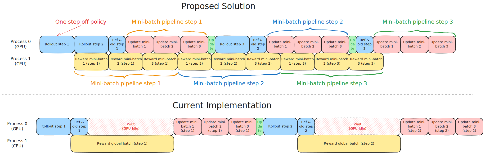

# Recipe: Asynchronous Reward Agent with Update Pipeline and One Step Off Policy Training

**Author:**  `haolinyan@tencent.com`

## Introduction

### Background

The reward mechanism plays a central role in reinforcement learning (RL) training, serving as the key guiding signal for agent learning. 
However, in real-world scenarios, especially during the early stages of RL training, constructing high-quality rules and reward models for reward calculation is often challenging. 
Traditional rule-based or simple reward models frequently fail to provide effective learning signals, leading to inefficient training and policy bias. 
Therefore, modern RL systems require more flexible and efficient reward evaluation mechanisms.  

Decoupling the reward evaluation mechanism from the model training process through API-based remote services offers a more flexible and scalable solution. 
This approach enables seamless integration of diverse evaluation methods, such as large language model-based scoring (LLM-as-a-Judge), retrieval-augmented generation (RAG) evaluation incorporating domain knowledge, and multi-dimensional metric assessments (e.g., safety, creativity, and factual accuracy). 
It not only mitigates potential policy bias (e.g., reward hacking) caused by oversimplified reward functions but also facilitates the accumulation of high-quality reward data during early training stages, laying a solid foundation for subsequent policy optimization.  Moreover, this solution supports independent iteration and upgrades of reward evaluation services, as well as resource sharing across multiple training tasks, significantly enhancing system scalability.

However, under this reward-training decoupled paradigm, the existing verl framework exhibits two critical shortcomings:

- **High communication latency reduces training efficiency**: In large-scale training, a single training step may require thousands of API requests, easily triggering service concurrency limits. Additionally, competition for service resources across multiple training tasks can lead to significant communication delays, blocking the entire training process (e.g., synchronous waiting for reward returns causes GPU idle time), thereby degrading overall training efficiency.  

- **Increased development overhead and constrained optimization potential**: The verl framework delegates the underlying computation of reward functions entirely to developers, requiring manual handling of concurrent network requests. This not only increases development burden but also restricts the framework's optimization potential in areas such as communication-computation co-scheduling.

### Solution

To address these issues, we designed and implemented an **asynchronous reward agent**, which allows developers to customize the reward function for individual responses. The agent is responsible for initiating concurrent requests and managing the lifecycle of all requests. This design enables us to optimize scheduling for the aforementioned communication bottlenecks. Specifically, we employ two strategies—**one-step off-policy** and **update pipeline**—to achieve effective overlap between communication and computation:  

1. **One-step off-policy**: Unlike the "One Step Off Async Trainer" implemented by [Meituan](https://verl.readthedocs.io/en/latest/advance/one_step_off.html), we reverted to the colocated design. This approach overlaps the computation time of the next-step rollout with the waiting time for current reward requests, thereby improving training efficiency.
2. **Update pipeline**: The existing method necessitates waiting for all rewards in the global batch to be collected before performing model updates, resulting in prolonged GPU idle time. To overcome this inefficiency, we implement a pipelined execution strategy that divides the global batch into mini-batches. This approach enables concurrent processing of asynchronous reward collection and model updates, effectively overlapping communication latency with computation.

These strategies mitigate latency by overlapping waiting time with computation, significantly improving training efficiency. In simulated experiments on the **GSM8K** benchmark, we demonstrate that the asynchronous reward agent, when combined with **one-step off-policy** and **update pipeline**, reduces training time by **30.4%** compared to the baseline.  



### Experimental Results

- **Task Configuration**: We employ the GSM8K dataset and introduce random artificial delays of 1–40 seconds during reward computation for each sample to simulate communication latency. This delay range is derived from analyzing the ratio between communication and computation latency in real-world industrial training processes, ensuring accurate simulation of communication bottlenecks in practical scenarios.
- **Machine Configuration**: 1 node with 8xH20 GPUs
- **Model**: Qwen2.5-3B-Instruct and Qwen2-7B-Instruct
- **Trainer Backend**: FSDP2 and Megatron
- **Max Response Length**: 1024 tokens
- **Algorithm**: GRPO
- **Rollout Engine**: vLLM

The experimental results demonstrate the following key findings:
- The proposed solution achieves comparable training accuracy to existing open-source results in the community.
- By incorporating the update pipeline and one-step off-policy strategies, we observe a reduction of up to 30.4% in total training time relative to the baseline.

| Backend | Strategy                 | Model        | Training Time | Accuracy (last/max) | Log                                                                  |
|------------------|----------------------------------|--------------|---------------|---------------------|----------------------------------------------------------------------------------|
| Megatron         | baseline (from community) | Qwen2-7B-Instruct     | -             | 89.61 / 89.61       | [Log](https://github.com/eric-haibin-lin/verl-data/blob/experiments/gsm8k/qwen2-7b_math_megatron.log) |
| Megatron         | baseline                         | Qwen2-7B-Instruct     | 17h53m        | 89.08 / 89.92       | [Log](../../recipe/async_reward_agent/assets/tensorboard/gsm8k_qwen2_7b_base)                                                             |
| FSDP             | baseline                         | Qwen2-7B-Instruct     | 18h24m        | 89.54 / 89.92       | [Log](../../recipe/async_reward_agent/assets/tensorboard/q7b_fsdp_base)                                                                   |
| Megatron         | update pipeline + one-step off-policy | Qwen2-7B-Instruct | **12h22m** (-30.4%) | 89.61 / 90.04       | [Log](../../recipe/async_reward_agent/assets/tensorboard/gsm8k_qwen2_7b_off_ppl)                                                          |
| FSDP             | update pipeline + one-step off-policy | Qwen2-7B-Instruct | **13h10m** (-28.44%) | 88.86 / 89.99       | [Log](../../recipe/async_reward_agent/assets/tensorboard/q7b_fsdp_off_ppl)                                                                |
| FSDP             | baseline                         | Qwen2.5-3B-Instruct   | 17h23m        | 87.87 / 88.10       | [Log](../../recipe/async_reward_agent/assets/tensorboard/q3b_fsdp_base)                                                                   |
| Megatron         | baseline                         | Qwen2.5-3B-Instruct   | 17h07m        | 88.02 / 88.02       | [Log](../../recipe/async_reward_agent/assets/tensorboard/q3b_mcore_base)                                                                  |
| FSDP             | update pipeline + one-step off-policy | Qwen2.5-3B-Instruct | **13h15m** (-23.78%) | 88.93 / 88.93       | [Log](../../recipe/async_reward_agent/assets/tensorboard/q3b_fsdp_off_ppl)                                                                |
| Megatron         | update pipeline + one-step off-policy | Qwen2.5-3B-Instruct | **13h10m** (-23.08%) | 87.19 / 88.40       | [Log](../../recipe/async_reward_agent/assets/tensorboard/q3b_mcore_off_ppl)

We performed additional evaluations to examine: (1) the individual contributions of the update pipeline and one-step off-policy strategies to training efficiency, and (2) the effects of the decoupled PPO loss (proposed in the [paper](https://arxiv.org/pdf/2505.24298) to mitigate policy inconsistency in off-policy training) on both training efficiency and model performance.

- Compared to the update pipeline strategy, the one-step off-policy approach achieves higher communication time overlap ratio, thereby significantly improving overall training efficiency.
- In the one-step off-policy setting, the proximal policy optimization (PPO) objective inherently enforces a constraint that limits the divergence between consecutive policy updates. Consequently, we do not observe a marked improvement in performance with the decoupled PPO loss compared to the baseline.

| Backend   | Strategy                              |  Model       | Training Time      | Accuracy (last/max) | Log                     |
|------------|---------------------------------------|------------|----------------|----------------|------------------------------|
| Megatron   | baseline                              | Qwen2-7B-Instruct   | 17h53m         | 89.08/89.92    | [Log](../../recipe/async_reward_agent/assets/tensorboard/gsm8k_qwen2_7b_base)          |
| Megatron   | one-step off-policy                   | Qwen2-7B-Instruct   | 13h23m (-24.7%) | 88.93/89.54    | [Log](../../recipe/async_reward_agent/assets/tensorboard/q7b_mcore_off)                |
| Megatron   | update pipeline                       | Qwen2-7B-Instruct   | 15h41m (-12.0%) | 89.31/89.99    | [Log](../../recipe/async_reward_agent/assets/tensorboard/gsm8k_qwen2_7b_async)         |
| Megatron   | update pipeline + one-step off-policy | Qwen2-7B-Instruct   | 12h22m (-30.4%) | 89.61/90.04    | [Log](../../recipe/async_reward_agent/assets/tensorboard/gsm8k_qwen2_7b_off_ppl)       |
| Megatron   | update pipeline + one-step off-policy + decoupled ppo loss | Qwen2-7B-Instruct | 12h21m (-30.4%) | 89.01/89.69    | [Log](../../recipe/async_reward_agent/assets/tensorboard/gsm8k_qwen2_7b_off_ppl_behav) |

## Implementation

### Reward Agent
We designed a `RayAsyncRewardAgent` object. When the `controller` process asynchronously calls the `compute_reward_pipeline` method via Ray to issue a global batch request, this function will submit the preprocessed request to the `pending_queue` and immediately return the number of requests.  

```python
@ray.remote
class RayAsyncRewardAgent:
    def __init__(self, config, tokenizer):
        self.executor = ThreadPoolExecutor(max_workers=self.max_concurrency)
        self.pending_queue = Queue()
        self.completed_queue = Queue()
        self.proxy_thread = threading.Thread(target=self.proxy_func)
        # User-defined reward function for single response
        compute_score = get_custom_reward_fn(config)
        ...

    def compute_reward_pipeline(self, data: DataProto, group_size=1):
        # 1. Initialize the request
        request = RewardRequest(
            max_seq_len=data.batch["responses"].shape[-1],
            group_size=group_size
        )

        # 2. Preprocess each data item and add to the request
        for data_idx in range(len(data)):
            ...

        # 3. Add to the pending queue
        self.pending_queue.put(request)
        return len(data)
```

The `RayAsyncRewardAgent` launches a daemon thread (`proxy_func`) to poll requests from the pending queue and assign each reward request to a worker thread in the thread pool. The worker threads then call the user-defined reward function to compute and return the rewards. The results are organized by `group_uid` and `data_idx`. Once all requests within a group (e.g., a GRPO group) are processed, the completed results are placed in the `completed_queue`.  

```python
@ray.remote
class RayAsyncRewardAgent:
    ...
    def proxy_func(self):
        while self.running:
            if not self.pending_queue.empty():
                request = self.pending_queue.get()
                # 1. Process requests in parallel
                futures = []
                for data in request.request_data:
                    future = self.executor.submit(self.user_defined_func, ...)
                    futures.append(future)

                # 2. Collect and process results in the order of completion
                for future in as_completed(futures):
                    score, query, response = future.result()
                    group_uid, data_idx = future.meta_info[:2]

                    # Update group information
                    request.group_dict[group_uid][0][data_idx] = score
                    request.group_dict[group_uid][1] -= 1

                    # 3. Process the results when the group is completed and add them to the completed_queue
                    if request.group_dict[group_uid][1] == 0:
                        sorted_scores = sorted(request.group_dict[group_uid][0].items())
                        rewards = [score for _, score in sorted_scores]
                        self.completed_queue.put(rewards)
                        del request.group_dict[group_uid]
            else:
                time.sleep(1)
```

The `controller` process remotely calls the `get` method to blockingly retrieve the required number of reward values from the `completed_queue`.  

```python
@ray.remote
class RayAsyncRewardAgent:
    ...
    def get(self, chunk_size, hook_func=None, **kwargs):
        # 1. Initialize the collection container
        data_idxs, rewards = [], []
        reward_extra_infos = {}

        # 2. Collect results from the queue
        while len(data_idxs) < chunk_size:
            if self.completed_queue.empty():
                time.sleep(0.1)
                continue

            # Retrieve and process queue data
            idxs, scores, lengths, max_len, extras = self.completed_queue.get()
            data_idxs.extend(idxs)
            rewards.extend(scores)
            # Merge additional information...

        # 3. Sort and format the results
        sort_idx = np.argsort(data_idxs)
        rewards = np.array(rewards)[sort_idx]

        # 4. Construct the reward tensor
        reward_tensor = torch.zeros(chunk_size, max_len)
        for i, (length, reward) in enumerate(zip(lengths, rewards)):
            reward_tensor[i, length-1] = reward

        # 5. Return the results (optional hook processing)
        return hook_func(data_idxs, reward_tensor, reward_extra_infos, **kwargs) if hook_func else \
               (data_idxs, reward_tensor, reward_extra_infos)
```
A typical flowchart for request, computation, and reward tensor collection is as follows:

<div style="width:60%;height:auto">

```{mermaid} 
sequenceDiagram
    participant Controller
    participant RayAsyncRewardAgent
    participant ThreadPool
    participant CompletedQueue
    participant ProxyThread

    Controller->>RayAsyncRewardAgent: compute_reward_pipeline(data)
    activate RayAsyncRewardAgent
    RayAsyncRewardAgent->>RayAsyncRewardAgent: Preprocess request
    RayAsyncRewardAgent->>PendingQueue: Store request
    RayAsyncRewardAgent-->>Controller: Return request count
    deactivate RayAsyncRewardAgent

    loop proxy_thread loop
        ProxyThread->>PendingQueue: Fetch request
        PendingQueue-->>ProxyThread: Return request
        activate ProxyThread
        ProxyThread->>ThreadPool: Submit computation task
        activate ThreadPool
        ThreadPool-->>ProxyThread: Return computation result
        deactivate ThreadPool
        ProxyThread->>ProxyThread: Update group status
        alt Group completed
            ProxyThread->>CompletedQueue: Store result
        end
        deactivate ProxyThread
    end

    Controller->>RayAsyncRewardAgent: get(chunk_size)
    activate RayAsyncRewardAgent
    loop Until enough results are collected
        RayAsyncRewardAgent->>CompletedQueue: Fetch result
        CompletedQueue-->>RayAsyncRewardAgent: Return result
    end
    RayAsyncRewardAgent->>RayAsyncRewardAgent: Sort and format results
    RayAsyncRewardAgent-->>Controller: Return reward tensor
    deactivate RayAsyncRewardAgent
```

</div>

### Update Pipeline
As shown in the figure below, current framework requires waiting until all rewards in the ​global batch​ are returned, resulting in prelonged GPU idle time. The data loader then splits the batch into multiple ​mini-batches​ for multi-iteration model updates.

The ​update pipeline strategy​ leverages ``RayAsyncRewardAgent`` to asynchronously collect rewards and update the model. It employs a pipelined approach by repeatedly calling the ``get`` method, each time retrieving one mini-batch of data and immediately updating the model. This process continues until all data in the ​global batch​ has been used for updates.


The main code changes are as follows:  

```diff
    def fit(self):
        ...
        while self.global_steps <= self.total_training_steps:
            ...
            with marked_timer("step", timing_raw):
                ...
+                # Calculate the number of mini-batches in the pipeline
+                total_mini_batch_num = (
+                    self.config.data.train_batch_size // self.config.actor_rollout_ref.actor.ppo_mini_batch_size
+                )
+                current_mini_batch_num = 0
+                mini_batch_list = []
+                # Enter the pipeline loop
+                while current_mini_batch_num < total_mini_batch_num:
                    with marked_timer("adv", timing_raw, color="brown"):
                        # we combine with rule-based rm
                        reward_extra_infos_dict: dict[str, list]
                        if self.config.get("update_pipeline", False):
+                            # Block and wait for the reward values of a mini-batch
+                            fin_mini_batch_idxs, reward_tensor, reward_extra_infos_dict = ray.get(
+                                self.reward_agent.get.remote(
+                                    self.config.actor_rollout_ref.actor.ppo_mini_batch_size
+                                    * self.config.actor_rollout_ref.rollout.n
+                                )
+                            )
+                            mini_batch = batch[fin_mini_batch_idxs]                           
+                            current_mini_batch_num += 1
+                            # Post-processing
+                            ...
                        else:
                            ...
                        mini_batch.batch["token_level_scores"] = reward_tensor
                        ...
                        # compute rewards. apply_kl_penalty if available
                        ...

                        # compute advantages, executed on the driver process
                        ...

                    # update critic
                    ...

                    # implement critic warmup
                    if self.config.trainer.critic_warmup <= self.global_steps:
                        # update actor
                        ...
                    ...
+                   # Add the used mini-batch to the list
+                   mini_batch_list.append(mini_batch)
+               # Merge all used mini-batches into a global batch
+               batch = DataProto.concat(mini_batch_list)
                ...
```

### One Step Off-Policy Training

We encapsulate the `rollout` and the process of initiating reward requests into the method `_rollout_and_request_rewards`, as shown below. When the rollout generation for a step is completed, the asynchronous reward request is immediately initiated by calling `RayAsyncRewardAgent.compute_reward_pipeline`, and the corresponding `global batch` is returned.  

```python  
    def _rollout_and_request_rewards(self, continuous_iterator):  
        """Rollout and request rewards from the reward agent for the generated sequences."""  
        ...  
        # 1. Rollout generates the global batch  
        with marked_timer("gen", timing_raw, color="red"):  
            if not self.async_rollout_mode:  
                gen_batch_output = self.actor_rollout_wg.generate_sequences(gen_batch)  
            else:  
                gen_batch_output = self.async_rollout_manager.generate_sequences(gen_batch)  
            timing_raw.update(gen_batch_output.meta_info["timing"])  
            gen_batch_output.meta_info.pop("timing", None)  
        ...  
        with marked_timer("reward", timing_raw, color="yellow"):  
            uids = batch.non_tensor_batch["uid"]  
            for idx in range(len(batch)):  
                batch.non_tensor_batch["extra_info"][idx].update(  
                    group_uid=uids[idx], group_size=self.config.actor_rollout_ref.rollout.n  
                )  
            # 2. Call the asynchronous reward computation function  
            if self.config.get("update_pipeline", False):  
                # Pipeline update strategy, non-blocking  
                future_reward = ray.get(  
                    self.reward_agent.compute_reward_pipeline.remote(  
                        batch, group_size=self.config.actor_rollout_ref.rollout.n  
                    )  
                )  
        ...  
        return batch, metrics, timing_raw, future_reward, epoch  
```  

The modifications to the `fit` function are as follows. Before the iteration begins, a global batch of data is pre-generated, and a reward computation task is initiated. At the start of the iteration, the `global batch` generated in the previous step and its corresponding reward handle are used for model updates. Then, the next global batch is generated, and a reward computation task is initiated for the next iteration, achieving one-step off-policy training.  

```diff
    def fit(self):  
        ...  
+       # Reference: https://github.com/volcengine/verl/blob/main/recipe/one_step_off_policy/ray_trainer.py#L303  
+       continuous_iterator = self._create_continuous_iterator()   
+       # Pre-generate a rollout and initiate a reward computation request  
+       last_batch, last_metrics, _, last_future_reward, last_epoch = self._rollout_and_request_rewards(  
+           continuous_iterator  
+       )  
        while self.global_steps <= self.total_training_steps:  
            ...  
+           # Use the rollout results and reward handle from the previous step  
+           batch = last_batch  
+           future_reward = last_future_reward  
+           epoch = last_epoch  
            with marked_timer("step", timing_raw):  
+               # Generate the rollout for the next step and initiate a reward computation task  
+               last_batch, last_metrics, last_timing_raw, last_future_reward, last_epoch = (  
+                   self._rollout_and_request_rewards(continuous_iterator)  
+               )  
            ...  
```

## Usage

### Reward Function Configuration Example
Developers need to customize a reward function to evaluate each individual response at a time,
for example:  
```python  
def compute_score(self,  
                    data_source: Any,  
                    solution_str: str,  
                    ground_truth: str,  
                    extra_info: Optional[dict] = None  
                    ) -> Tuple[float, str, str]:  
        """  
        Calculate and return the score of the solution.  

        Parameters:  
            data_source: Data source object  
            solution_str: Solution string to be scored  
            ground_truth: Standard answer  
            extra_info: Extra information dictionary (optional)  

        Returns:  
            A tuple containing three elements:  
            - Score value (float)  
            - Original solution string (str)  
            - Score explanation string (str)  
        """  
        ...  
        score = ...  
        return score, solution_str, f"score: {score}"  
```  

Then, specify the function name and file path into the following training configuration:  
```bash  
custom_reward_function.path=${reward_file} \  
custom_reward_function.name=compute_score  
```  

For cases where stateful metadata (e.g., userId, token, etc.) needs to be maintained during the evaluation process, the ``RayAsyncRewardAgent`` supports using a custom class (instead of just a function) by passing it to the `custom_reward_function.name` parameter mentioned above. For example: 
```python  
class Gsm8kAgent:  
    def __init__(self):  
        self.latency = 40  

    def compute_score(  
        self,  
        data_source: Any,  
        solution_str: str,  
        ground_truth: str,  
        extra_info: Optional[dict] = None,  
    ) -> tuple[float, str, str]:  
        score = compute_score(data_source, solution_str, ground_truth, extra_info, latency=self.latency)  
        return score, solution_str, f"score: {score}"  
```  
```bash  
custom_reward_function.path=${reward_file} \  
custom_reward_function.name=Gsm8kAgent  
```  

For cases where rewards need to be post-processed on a group basis, such as filling in abnormal or invalid scores with the group's average score, the `post_process_scores` method can be implemented with custom post-processing logic:  
```python  
class Gsm8kAgent:  
    def __init__(self):  
        pass  
    def post_process_scores(self, rewards: List[float]) -> List[float]:  
        ...  
        return scores  
```
### FSDP2 Configuration Example
```shell
python3 -m recipe.async_reward_agent.main_ppo \
    --config-path="${HOME}/verl/trainer/config" \
    actor_rollout_ref.actor.strategy=fsdp2 \
    custom_reward_function.path=${reward_file} \  
    custom_reward_function.name=${reward_function_name} \
    reward_model.reward_manager=batch \
    reward_model.launch_reward_fn_async=True \
    # enable update pipeline strategy
    +update_pipeline=True
```

### Megatron Configuration Example
```shell
python3 -m recipe.async_reward_agent.main_ppo \
    --config-path="${HOME}/verl/trainer/config" 
    --config-name='ppo_megatron_trainer.yaml'\
    actor_rollout_ref.actor.strategy=megatron \
    custom_reward_function.path=${reward_file} \  
    custom_reward_function.name=${reward_function_name} \
    reward_model.reward_manager=batch \
    reward_model.launch_reward_fn_async=True \
    # enable update pipeline strategy
    +update_pipeline=True
    
```

## Functional Support
| Category           | Support Situation                                                                                               |
|--------------------|-----------------------------------------------------------------------------------------------------------------|
| train engine       | FSDP2  <br/> Megatron                                                                                           |
| rollout engine     | vLLM                                                                                                            |
| AdvantageEstimator | GRPO                                                                                  |

> Note:​​ Support for additional advanced estimators—including GRPO_PASSK, REINFORCE_PLUS_PLUS, RLOO, OPO, REINFORCE_PLUS_PLUS_BASELINE, and GPG—is currently under testing.
