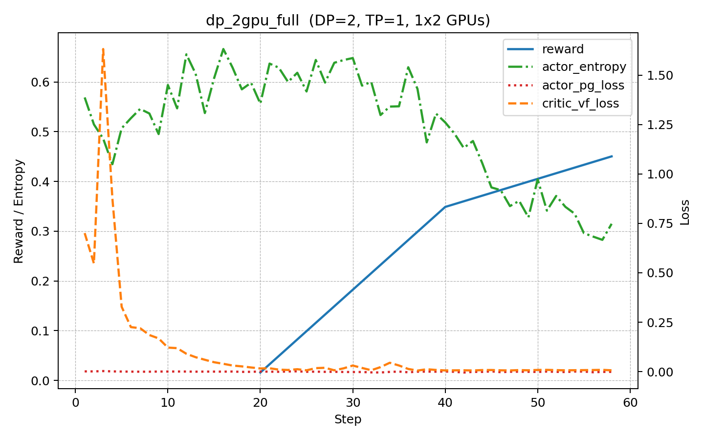
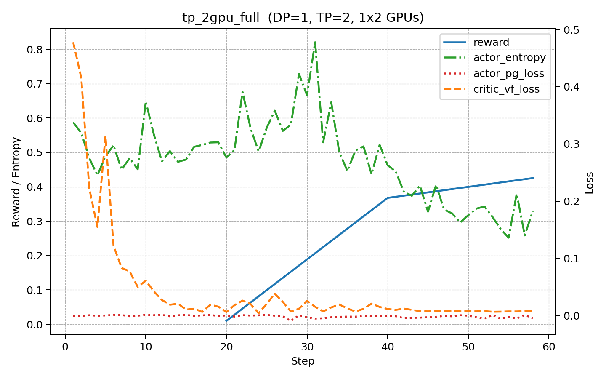
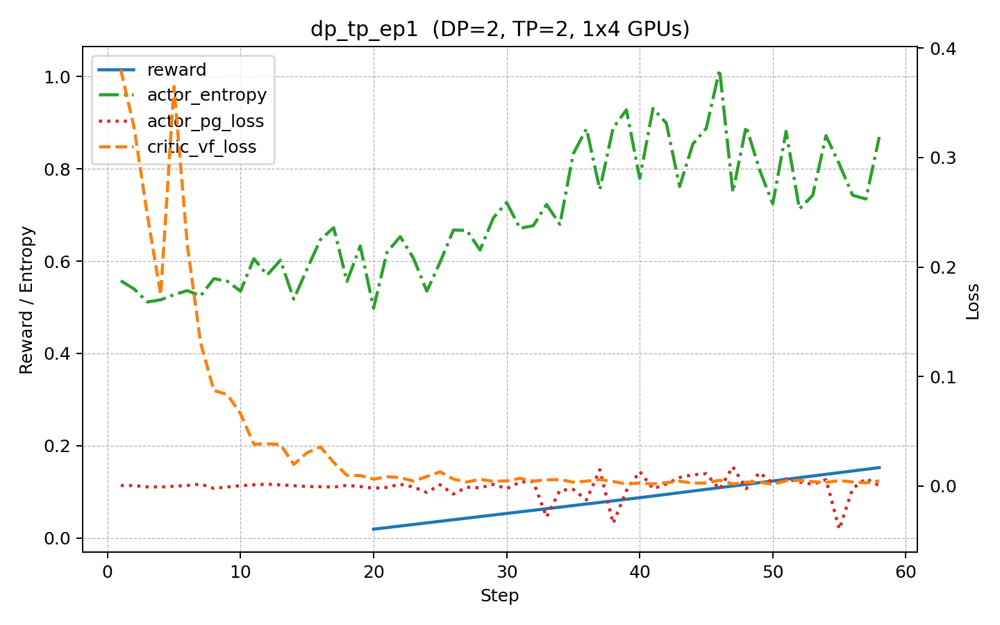
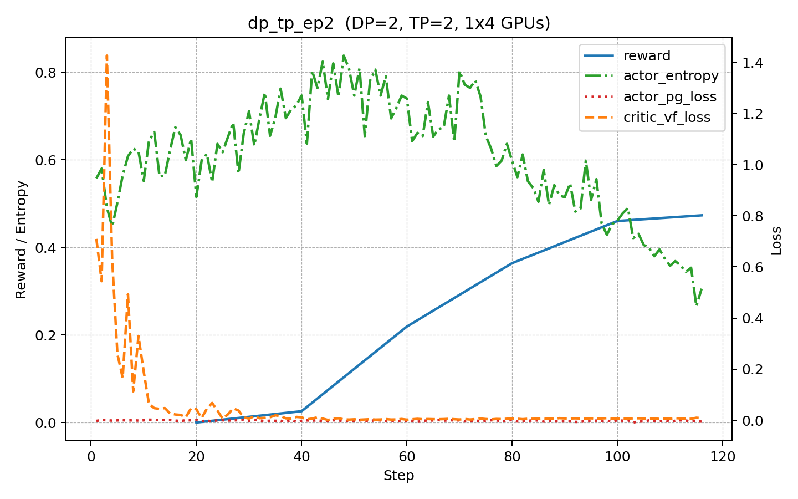

# DeepSpeed PPO 四种设置对比（每个设置一张图）

## dp_2gpu_full

- 配置要点：
  - trainer.nnodes: 1
  - trainer.n_gpus_per_node: 2
  - derived_data_parallel_size: 2
  - tensor_model_parallel_size: 1
  - pipeline_model_parallel_size: 1
  - ppo_mini_batch_size: 128
  - ppo_micro_batch_size_per_gpu: 8
  - gradient_accumulation_steps: 8
- 最终 reward（最后一步）: 0.4503

## tp_2gpu_full

- 配置要点：
  - trainer.nnodes: 1
  - trainer.n_gpus_per_node: 2
  - derived_data_parallel_size: 1
  - tensor_model_parallel_size: 2
  - pipeline_model_parallel_size: 1
  - ppo_mini_batch_size: 128
  - ppo_micro_batch_size_per_gpu: 8
  - gradient_accumulation_steps: 8
- 最终 reward（最后一步）: 0.4253

## dp_tp_ep1

- 配置要点：
  - trainer.nnodes: 1
  - trainer.n_gpus_per_node: 4
  - derived_data_parallel_size: 2
  - tensor_model_parallel_size: 2
  - pipeline_model_parallel_size: 1
  - ppo_mini_batch_size: 128
  - ppo_micro_batch_size_per_gpu: 8
  - gradient_accumulation_steps: 8
- 最终 reward（最后一步）: 0.1524

## dp_tp_ep2

- 配置要点：
  - trainer.nnodes: 1
  - trainer.n_gpus_per_node: 4
  - derived_data_parallel_size: 2
  - tensor_model_parallel_size: 2
  - pipeline_model_parallel_size: 1
  - ppo_mini_batch_size: 128
  - ppo_micro_batch_size_per_gpu: 8
  - gradient_accumulation_steps: 8
- 最终 reward（最后一步）: 0.4731
