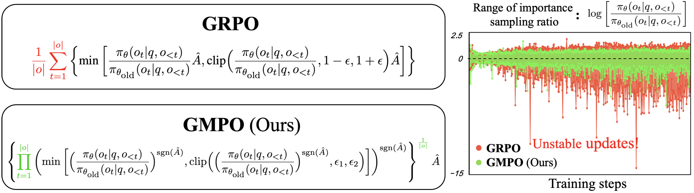

<div align=center>
  
# Geometric-Mean Policy Optimization
</div>

This is the official implementaion of paper [***Geometric-Mean Policy Optimization***](https://arxiv.org/pdf/2401.17910.pdf). This repository contains Pytorch training code, evaluation code, pre-trained models, and visualization method.

<div align=center>

[](https://arxiv.org/pdf/2401.17910.pdf)


[](LICENSE)
</div>


<div align=center>

</div>


## 1. Contents
- Geometric-Mean Policy Optimization
  - [1. Contents](#1-contents)
  - [2. Introduction](#2-introduction)
  - [3. Code Usage](#4-code-usage)
  - [4. Contacts](#5-contacts)
  - [5. Citation](#7-citation)

## 2. Introduction

Recent advancements, such as Group Relative Policy Optimization (GRPO), have enhanced the reasoning capabilities of large language models by optimizing the arithmetic mean of token-level rewards. However, GRPO suffers from unstable policy updates when processing tokens with outlier importance-weighted rewards, which manifests as extreme importance sampling ratios during training, i.e., the ratio between the sampling probabilities assigned to a token by the current and old policies. In this work, we propose Geometric-Mean Policy Optimization (GMPO), a stabilized variant of GRPO. Instead of optimizing the arithmetic mean, GMPO maximizes the geometric mean of token-level rewards, which is inherently less sensitive to outliers and maintains a more stable range of importance sampling ratio. In addition, we provide comprehensive theoretical and experimental analysis to justify the design and stability benefits of GMPO. Beyond improved stability, GMPO-7B outperforms GRPO by an average of 4.1% on multiple mathematical benchmarks and 1.4% on multimodal reasoning benchmark, including AIME24, AMC, MATH500, OlympiadBench, Minerva, and Geometry3K.

## 3. Code Usage

```
bash examples/gmpo_trainer/run_qwen2_5-7b_math.sh
```

## 4. Contacts
If you have any question about our work or this repository, please don't hesitate to contact us by emails or open an issue under this project.
- [zhaoyuzhong20@mails.ucas.ac.cn](zhaoyuzhong20@mails.ucas.ac.cn)
- [liuyue171@mails.ucas.ac.cn](liuyue171@mails.ucas.ac.cn)

## 5. Citation

Coming soon...
