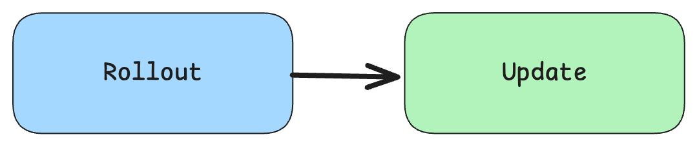
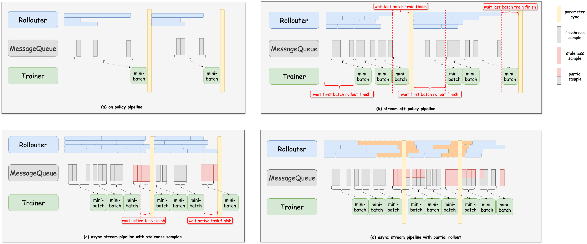
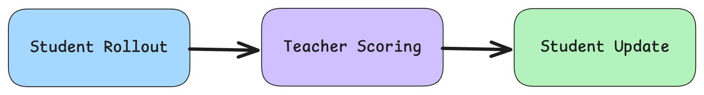

# On-Policy Distillation (OPD) Implementation Plan

## Overview

OPD is already implemented in `verl`. For Qwen-2.5-0.5B-Instruct student and Qwen-2.5-7B-Instruct teacher:

```bash
python -m verl.trainer.main_ppo \
    actor_rollout_ref.model.path=Qwen/Qwen2.5-0.5B-Instruct \
    +actor_rollout_ref.ref.model.path=Qwen/Qwen2.5-7B-Instruct \
    actor_rollout_ref.actor.kl_loss_coef=1
```
Note that this will still use rewards for the student model rollouts, but these can be set to zero if you want to do pure distillation.

This implementation can be made more efficient using async, so OPD will be implemented as a part of `verl.experimental.fully_async_policy`.  

## Async RL

In RL, there are two main phases: 



To make this more efficient, `fully_async_policy` implements various degrees of asynchrony between the rollout and training phases:



## Async OPD Implementation Plan

In OPD, there is an additional phase for using the teacher model to score the rollouts from the student model, which are then used by a distillation loss to update the student model:



To implement OPD in an async manner, we will add a new phase for the teacher model scoring:


