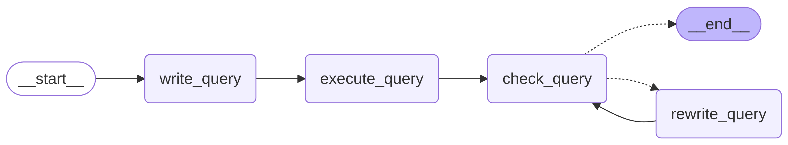
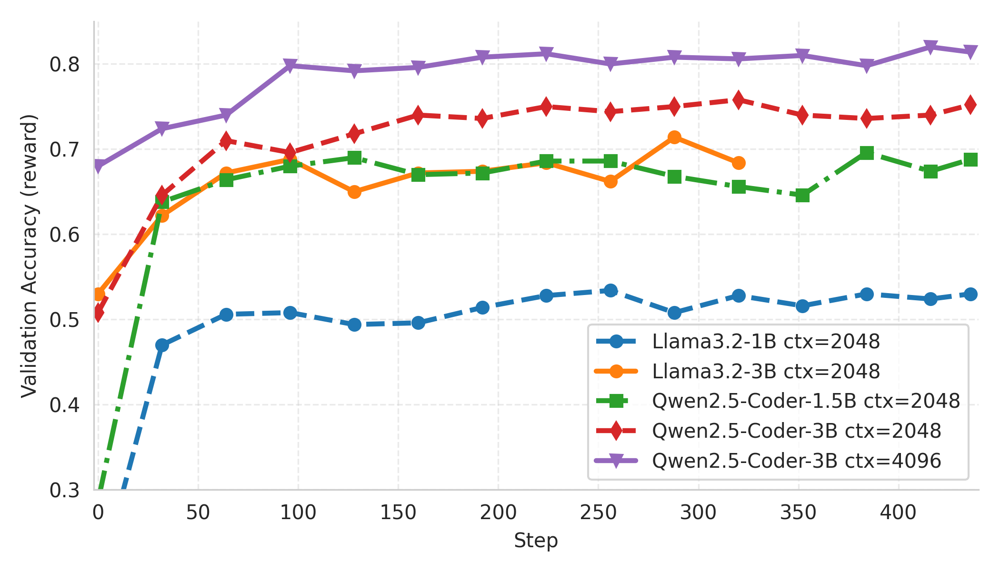

# SQL Agent with Agent Lightning

This example demonstrates how to build and train a self-correcting SQL agent. It leverages [Agent Lightning](https://github.com/microsoft/agent-lightning) and the `verl` framework for Reinforcement Learning (RL) based training, and LangGraph to define the agent's complex, cyclical reasoning workflow. The goal is to fine-tune a Large Language Model (LLM) to accurately convert natural language questions into executable SQL queries.

**The example is tested with verl v0.5.0 and Agent Lightning v0.1.1.**

## SQL Agent Implementation

The design of Agent-lightning **allows flexible integration with various agent frameworks**, including AutoGen, CrewAI, OpenAI Agent SDK, LangGraph, and more. It can also work without agent frameworks, allowing you to train an agent built from scratch with Python code. See [our example gallery](https://github.com/microsoft/agent-lightning/tree/main/examples) for more details.

The core of the agent is a state machine built with LangGraph, which allows for a robust and transparent workflow. The agent's logic, as visualized below, starts by writing a query, executes it, and then enters a refinement loop where it checks and rewrites the query until it is deemed correct or a turn limit is reached.



This workflow is implemented in the `SQLAgent` class within `sql_agent.py`. It consists of the following key steps:

1. **write_query**: Given a user's question and database schema, the agent makes an initial attempt to write a SQL query.
2. **execute_query**: The generated query is run against the target database.
3. **check_query**: The agent analyzes the original query and its execution result (or error) to check for mistakes. It uses a specific prompt (`CHECK_QUERY_PROMPT`) to determine if the query is correct.
4. **rewrite_query**: If the `check_query` step finds errors, the agent enters this step. It uses the feedback from the previous step to generate a corrected SQL query. The process then loops back to `check_query` for re-evaluation.
5. **END**: The loop terminates when `check_query` confirms the query is correct or the maximum number of turns (`max_turns`) is exceeded.

We aim to train **write_query** and **rewrite_query** step in the setup of this example. The **check_query** step is not trained but will share the same LLM weights as the other steps.

## Client-Server Training with Agent Lightning

The training process uses a distributed client-server architecture designed by Agent Lightning to efficiently fine-tune the underlying LLM. This separation allows for scalable data generation across multiple clients while centralizing the computationally intensive model training on a dedicated server with GPUs, and also provides opportunities for customizing algorithms and training strategies (like [prompt optimization](https://github.com/microsoft/agent-lightning/tree/160a82b0354969122ff3667937bab75c0a09a21e/examples/apo)) with minimal code changes.

* **Training Server (`agentlightning.verl`)**: The server, launched with the first command below, manages the core training loop. It runs an RL algorithm (with `verl` of course) and hosts an OpenAI-compatible LLM endpoint (with `verl`'s async server). The server's sole purpose is to receive interaction data from clients and update the LLM's weights to improve its performance. [This link](https://github.com/microsoft/agent-lightning/tree/160a82b0354969122ff3667937bab75c0a09a21e/agentlightning/verl) points to the implementation of the server, which is built upon `verl`.
* **Agent Clients (`sql_agent.py`)**: The clients run the LangGraph agent logic described above. They connect to the server to fetch tasks (natural language questions) and use the server's **OpenAI-compatible endpoint** for all generation steps (`write_query`, `check_query`, `rewrite_query`). After completing a task, the client exports its interaction traces (traced by [AgentOps](https://www.agentops.ai/) and filtered by trace hierarchy), evaluates its correctness to calculate a reward, and sends the entire interaction history (the "trajectory") back to the server for training. To adapt any agent to an "agent client", you do not need to change the agent logic, but only need to invoke the client's `run` method with `agentlightning.trainer`.


## Running the Example

1. Prepare the dataset: download from [here](https://drive.google.com/file/d/1oi9J1jZP9TyM35L85CL3qeGWl2jqlnL6/view) and unzip it to the `data` folder.
   ```bash
   pip install gdown
   gdown --fuzzy https://drive.google.com/file/d/1oi9J1jZP9TyM35L85CL3qeGWl2jqlnL6/view
   unzip -q spider-data.zip -d data
   rm spider-data.zip
   ```

2. Install the required dependencies:
   ```bash
   pip install -r requirements.txt
   ```

3. Launch the training server:
   ```bash
   python -m agentlightning.verl \
       agentlightning.port=9997 \
       algorithm.adv_estimator=grpo \
       data.train_files=data/train_spider.parquet \
       data.val_files=data/test_dev_500.parquet \
       actor_rollout_ref.rollout.tensor_model_parallel_size=1 \
       trainer.n_gpus_per_node=1 \
       data.train_batch_size=32 \
       actor_rollout_ref.rollout.n=4 \
       actor_rollout_ref.actor.ppo_mini_batch_size=32 \
       actor_rollout_ref.actor.ppo_micro_batch_size_per_gpu=4 \
       actor_rollout_ref.rollout.log_prob_micro_batch_size_per_gpu=4 \
       actor_rollout_ref.rollout.multi_turn.format=hermes \
       actor_rollout_ref.model.path=Qwen/Qwen2.5-Coder-3B-Instruct \
       data.max_prompt_length=4096 \
       data.max_response_length=2048 \
       data.truncation='error' \
       trainer.val_before_train=True \
       actor_rollout_ref.actor.optim.lr=1e-6 \
       actor_rollout_ref.model.use_remove_padding=True \
       actor_rollout_ref.actor.use_kl_loss=False \
       actor_rollout_ref.actor.kl_loss_coef=0.000 \
       actor_rollout_ref.actor.entropy_coeff=0 \
       actor_rollout_ref.actor.clip_ratio_low=0.2 \
       actor_rollout_ref.actor.clip_ratio_high=0.3 \
       actor_rollout_ref.model.enable_gradient_checkpointing=True \
       actor_rollout_ref.actor.fsdp_config.param_offload=True \
       actor_rollout_ref.actor.fsdp_config.optimizer_offload=True \
       actor_rollout_ref.rollout.name=vllm \
       actor_rollout_ref.rollout.gpu_memory_utilization=0.8 \
       actor_rollout_ref.ref.log_prob_micro_batch_size_per_gpu=8 \
       actor_rollout_ref.ref.fsdp_config.param_offload=True \
       algorithm.use_kl_in_reward=False \
       trainer.critic_warmup=0 \
       trainer.logger=['console','wandb'] \
       trainer.project_name=AgentLightning \
       trainer.experiment_name=train_sql_agent \
       trainer.nnodes=1 \
       trainer.save_freq=256 \
       trainer.test_freq=32 \
       trainer.total_epochs=2
    ```

4. Launch agent clients that connect with the server:
   ```bash
   export VERL_API_BASE=http://localhost:9997/  # Same as the server port. This is used for receiving tasks and sending results.
   python sql_agent.py \
       --litsqlagent.trained-agents write \  # Will only train the write and rewrite agent.
       --trainer.n-workers 16 \
       --litsqlagent.val-temperature 0
   ```

There is no hard requirement in the launching order of the server and clients. But remember to kill the long-running agent clients after the training is done.

## Debug the Agent without verl

You can run the agent client alone without the `verl` server. This is useful for debugging the agent logic and SQL execution.

1. Copy `.env.example` to `.env` and fill in your OpenAI API key. `VERL_API_BASE` does not really matter here because you are not connecting to the server end.

2. Run the agent client:
   ```bash
   dotenv run python sql_agent.py \
       --litsqlagent.trained-agents write \  # Will only select the trajectories related to write and rewrite.
       --trainer.n-workers 1 \  # For debug, use single process.
       --trainer.dev true  # Enable the dev debug mode.
   ```

## Evaluation

The example is evaluated using Qwen2.5-Coder-Instruct and Llama-3.2-Instruct models. The models are trained on the Spider dataset for 2 epochs, with evaluation performed on a randomly selected subset of 500 test samples to compute held-out accuracy. The default setup for running agent clients during evaluation is as follows:

```bash
python sql_agent.py \
   --litsqlagent.trained-agents write \
   --trainer.n-workers 16 \
   --trainer.daemon true \
   --litsqlagent.val-temperature 0 \
   --litsqlagent.max-turns 3 \
   --litsqlagent.table-info-truncate 2048 \
   --litsqlagent.execution-truncate 2048
```

### Performance Metrics



| Model         | Size   |   Context |   Max Turns | Agents                        |   Acc (Initial) |   Acc (Final) | Transitions   |   Prompt Length | Response Length   |
|---------------|--------|-----------|-------------|-------------------------------|-----------------|---------------|---------------|-----------------|-------------------|
| Llama3.2      | 1B     |      2048 |           3 | write&#124;rewrite            |            18.8 |          53   | 2.89 → 3.00   |           800.9 | 299.1 → 15.9      |
| Llama3.2      | 3B     |      2048 |           3 | write&#124;rewrite            |            53   |          68.4 | 2.26 → 2.52   |           833   | 123.8 → 36.7      |
| Qwen2.5-Coder | 1.5B   |      2048 |           3 | write&#124;rewrite            |            28.6 |          68.8 | 2.74 → 2.99   |           846   | 38.0 → 33.8       |
| Qwen2.5-Coder | 3B     |      2048 |           1 | write&#124;rewrite            |            63.8 |          73.2 | 1.00 → 1.00   |           707.9 | 36.9 → 32.8       |
| Qwen2.5-Coder | 3B     |      2048 |           3 | rewrite&#124;check            |            63.4 |          74   | 2.31 → 1.64   |           969.5 | 22.0 → 54.9       |
| Qwen2.5-Coder | 3B     |      2048 |           3 | write&#124;rewrite            |            50.8 |          75.2 | 2.02 → 1.78   |           799.9 | 43.9 → 29.1       |
| Qwen2.5-Coder | 3B     |      2048 |           3 | write&#124;rewrite            |            62.4 |          74.2 | 1.63 → 1.40   |           793.7 | 37.3 → 28.9       |
| Qwen2.5-Coder | 3B     |      2048 |           3 | write&#124;rewrite&#124;check |            63.4 |          73   | 3.32 → 2.58   |           864.7 | 30.7 → 32.4       |
| Qwen2.5-Coder | 3B     |      4096 |           1 | write&#124;rewrite            |            68.8 |          80.2 | 1.00 → 1.00   |           974.2 | 36.4 → 31.1       |
| Qwen2.5-Coder | 3B     |      4096 |           3 | write&#124;rewrite            |            68   |          81.4 | 1.54 → 1.47   |          1052   | 36.7 → 31.3       |

**Notes:**

1. **Context Length**: Controlled via `--litsqlagent.table-info-truncate <context-length>` and `--litsqlagent.execution-truncate <context-length>`
2. **Max Turns**: Set using `--litsqlagent.max-turns <max-turns>`
3. **Trained Agents**: Specified with `--litsqlagent.agents <regex>` (defaults to `write`, which matches both write and rewrite agents)
4. **Transitions**: Represents the number of prompt-response pairs collected during each rollout. Note that this differs from the turn count in the SQL agent workflow, where one turn may encompass 2-3 transitions in the check-rewrite cycle.
5. **Prompt/Response Length**: Average token count per prompt/transition response.

### Efficiency Metrics

| Model         | Size   |   Context |   Max Turns | Agents                        |   # Steps |   Time/Step (s) |   Rollout Time (%) |   Update Actor Time (%) |
|---------------|--------|-----------|-------------|-------------------------------|-----------|-----------------|--------------------|-------------------------|
| Llama3.2      | 1B     |      2048 |           3 | write&#124;rewrite            |       436 |            62.1 |               71.6 |                    21.8 |
| Llama3.2      | 3B     |      2048 |           3 | write&#124;rewrite            |       335 |           122.5 |               76.3 |                    18.3 |
| Qwen2.5-Coder | 1.5B   |      2048 |           3 | write&#124;rewrite            |       436 |            63.8 |               63.1 |                    28.5 |
| Qwen2.5-Coder | 3B     |      2048 |           1 | write&#124;rewrite            |       436 |            47   |               69.1 |                    23.4 |
| Qwen2.5-Coder | 3B     |      2048 |           3 | rewrite&#124;check            |       307 |           122   |               68.5 |                    24.1 |
| Qwen2.5-Coder | 3B     |      2048 |           3 | write&#124;rewrite            |       436 |            76.1 |               66.7 |                    25.3 |
| Qwen2.5-Coder | 3B     |      2048 |           3 | write&#124;rewrite            |       436 |            73.7 |               66.7 |                    25.2 |
| Qwen2.5-Coder | 3B     |      2048 |           3 | write&#124;rewrite&#124;check |       436 |           100.4 |               56.4 |                    33.5 |
| Qwen2.5-Coder | 3B     |      4096 |           1 | write&#124;rewrite            |       436 |            66   |               55.7 |                    34   |
| Qwen2.5-Coder | 3B     |      4096 |           3 | write&#124;rewrite            |       436 |            83.1 |               61.8 |                    28.8 |

**Notes:**

1. **Hardware Configuration**: Training is conducted on mixed hardware setups, typically using 1-2 80GB A100/H100 GPUs. Larger models (e.g., 3B parameters) require additional GPU memory and may benefit from multi-GPU configurations.
2. **Training Completion**: Some experimental runs completed fewer training steps due to technical constraints encountered during the limited training window. These limitations included response length explosion (which significantly slowed training throughput) and occasional cluster infrastructure failures.
