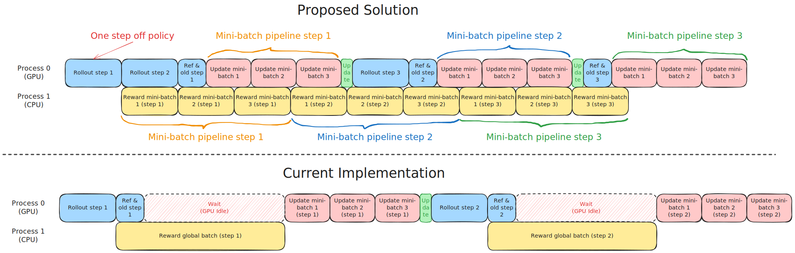
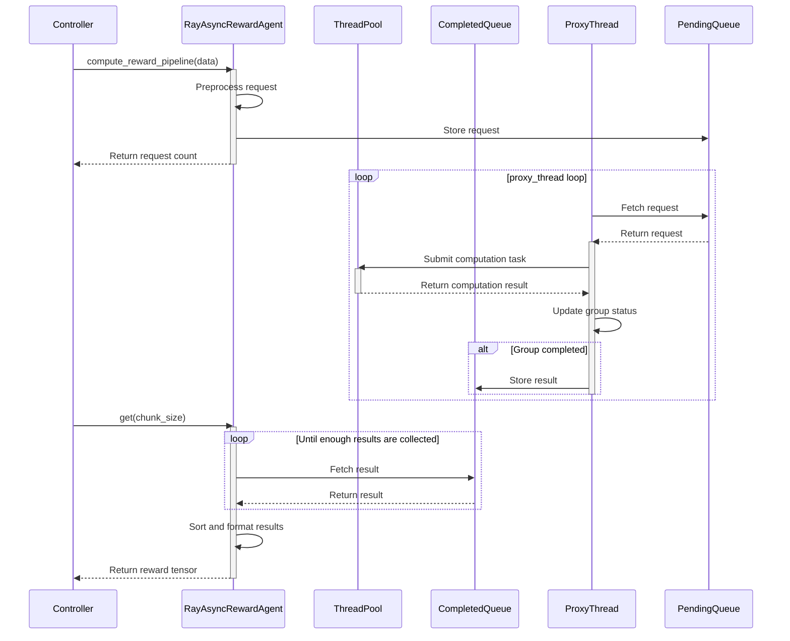
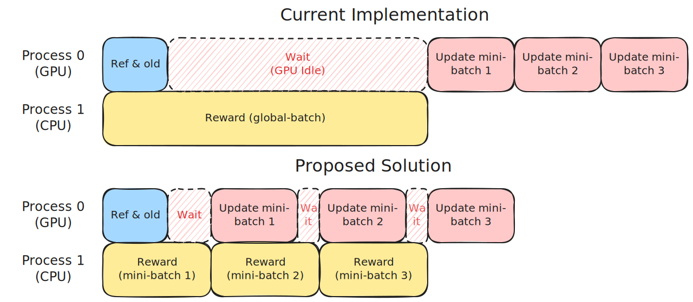

<!-- The below code in this distribution has been modified by Tencent ("Tencent Modifications"). 
All Tencent Modifications are Copyright (C) Tencent.

Licensed under the Apache License, Version 2.0 (the "License");
you may not use this file except in compliance with the License.
You may obtain a copy of the License at

     http://www.apache.org/licenses/LICENSE-2.0

Unless required by applicable law or agreed to in writing, software
distributed under the License is distributed on an "AS IS" BASIS,
WITHOUT WARRANTIES OR CONDITIONS OF ANY KIND, either express or implied.
See the License for the specific language governing permissions and
limitations under the License. -->

# 方案：基于流水线更新与单步离线策略训练的异步奖励代理机制

**作者：** `haolinyan@tencent.com`

## 引言

### 研究背景

强化学习（RL）的训练效果高度依赖奖励机制的设计，在真实业务场景中，尤其是训练初期，由于高质量规则和奖励模型的构建难度较大，传统基于规则或简单奖励模型的方法往往难以提供有效的学习信号，导致训练效率低下、策略偏差等问题。因此当前的RL系统需要更加灵活与高效的奖励评估机制；通过API化远程服务将奖励评估机制与模型训练过程解耦，是一种更具灵活性和可扩展性的方案。这种方案支持多样化评估方法的灵活集成，例如基于大语言模型的评分（LLM-as-a-Judge）、结合已有领域知识的检索增强生成（RAG）评估，以及多维度指标（如安全性、创造性和事实准确性）的综合评判。不仅能有效规避因奖励函数过于简化而可能导致的策略偏差（Reward Hacking），还能在训练初期高效积累高质量奖励数据，为后续策略优化奠定基础。此外，该方案支持奖励评估服务的独立迭代升级以及多训练任务间的资源共享，显著提升了系统的可拓展性。

然而，在这种奖励评估-训练解耦的方案中，现有的verl框架存在两个关键问题

- **通信延迟高导致训练效率低** ：在大规模训练中，单个训练步骤可能需要发起数千次API请求，极易触发服务的并发限制，以及考虑到多个训练任务相互竞争服务资源等情况，导致显著的通信延迟，阻塞整个训练流程（例如，同步等待奖励返回会造成GPU闲置），从而降低整体训练效率；
- **开发负担加重且优化空间受限** ：verl框架将奖励函数的底层计算接口完全交由开发者实现，要求开发者手动处理并发网络请求。这不仅增加了开发负担，还限制了框架在通信-计算协同调度等方面的优化潜力；


### 解决方案

针对上述问题，我们设计实现了**异步奖励代理**，允许开发者自定义单条响应的奖励函数，由代理负责并发请求的发起与全生命周期管理。该设计使我们能对前述通信瓶颈进行调度优化。具体我们采用**单步离线策略**与**流水线更新**两种策略实现通信与计算的有效重叠：

1. **单步离线策略**：不同于[美团](https://verl.readthedocs.io/en/latest/advance/one_step_off.html)实现的"One Step Off Async Trainer"，我们使用 colcated 模式，通过将下一步rollout的计算时间与当前奖励请求等待时间重叠，提升训练效率。
2. **流水线更新**：现有方法需等待全局批次所有奖励收集完成后才进行模型更新，导致GPU长时间闲置。为克服该低效问题，我们采用流水线执行策略，将全局批次划分为多个mini-batch，实现异步奖励收集与模型更新的并发处理，有效重叠通信延迟与计算时间。

通过这两种策略，我们利用计算时间覆盖了通信等待时间，显著提升了训练效率。在GSM8K模拟实验中，我们证实：当异步奖励代理配合单步离线策略和流水线更新策略使用时，相比基线方案可有效缩短30%的训练时间。



### 实验结果  

- **任务配置**：我们使用GSM8K数据集，并在每个样本的奖励计算过程中引入1~40秒的随机人工延迟来模拟通信延迟，该延迟范围是通过分析实际工业界训练过程中通信与计算延迟的比例得到的数值范围，能够准确模拟真实场景中的通信瓶颈
- **机器配置**：1个节点，配备8块H20 GPU  
- **模型**：Qwen2.5-3B-Instruct与Qwen2-7B-Instruct  
- **训练后端**：FSDP2与Megatron  
- **最大响应长度**：1024 tokens  
- **算法**：GRPO  
- **Rollout 引擎**：vLLM  

实验结果如下所示: 
- 所提方案达到了与开源社区现有结果相当的训练精度。  
- 通过结合流水线更新与单步离线策略，相较于基线方法，总训练时间最高可减少**30.4%**。  

| Backend | Strategy                 | Model        | Training Time | Accuracy (last/max) | Log                                                                  |
|------------------|----------------------------------|--------------|---------------|---------------------|----------------------------------------------------------------------------------|
| Megatron         | baseline (from community) | Qwen2-7B-Instruct     | -             | 89.61 / 89.61       | [Log](https://github.com/eric-haibin-lin/verl-data/blob/experiments/gsm8k/qwen2-7b_math_megatron.log) |
| Megatron         | baseline                         | Qwen2-7B-Instruct     | 17h53m        | 89.08 / 89.92       | [Log](./assets/tensorboard/gsm8k_qwen2_7b_base)                                                             |
| FSDP             | baseline                         | Qwen2-7B-Instruct     | 18h24m        | 89.54 / 89.92       | [Log](./assets/tensorboard/q7b_fsdp_base)                                                                   |
| Megatron         | update pipeline + one-step off-policy | Qwen2-7B-Instruct | **12h22m** (-30.4%) | 89.61 / 90.04       | [Log](./assets/tensorboard/gsm8k_qwen2_7b_off_ppl)                                                          |
| FSDP             | update pipeline + one-step off-policy | Qwen2-7B-Instruct | **13h10m** (-28.44%) | 88.86 / 89.99       | [Log](./assets/tensorboard/q7b_fsdp_off_ppl)                                                                |
| FSDP             | baseline                         | Qwen2.5-3B-Instruct   | 17h23m        | 87.87 / 88.10       | [Log](./assets/tensorboard/q3b_fsdp_base)                                                                   |
| Megatron         | baseline                         | Qwen2.5-3B-Instruct   | 17h07m        | 88.02 / 88.02       | [Log](./assets/tensorboard/q3b_mcore_base)                                                                  |
| FSDP             | update pipeline + one-step off-policy | Qwen2.5-3B-Instruct | **13h15m** (-23.78%) | 88.93 / 88.93       | [Log](./assets/tensorboard/q3b_fsdp_off_ppl)                                                                |
| Megatron         | update pipeline + one-step off-policy | Qwen2.5-3B-Instruct | **13h10m** (-23.08%) | 87.19 / 88.40       | [Log](./assets/tensorboard/q3b_mcore_off_ppl)

我们通过进一步实验验证了以下两个方面：(1) 流水线更新与单步离线策略对训练效率的独立贡献；(2) 解耦PPO损失函数（如[论文](https://arxiv.org/pdf/2505.24298)所述，用于缓解离线策略训练中的策略不一致性问题）对训练效率及模型性能的影响。  

- **策略效果对比**：相较于流水线更新策略，单步离线策略方法实现了更高的计算-通信时间重叠率，因而显著提升了整体训练效率。  
- **损失函数分析**：在单步离线策略设定下，近端策略优化（PPO）目标函数本身通过约束目标限制了两次连续更新的策略间的分布偏差。因此，相较于基线方法，采用解耦PPO损失并未观察到明显的性能提升。  

| Backend   | Strategy                              |  Model       | Training Time      | Accuracy (last/max) | Log                     |
|------------|---------------------------------------|------------|----------------|----------------|------------------------------|
| Megatron   | baseline                              | Qwen2-7B-Instruct   | 17h53m         | 89.08/89.92    | [Log](./assets/tensorboard/gsm8k_qwen2_7b_base)          |
| Megatron   | one-step off-policy                   | Qwen2-7B-Instruct   | 13h23m (-24.7%) | 88.93/89.54    | [Log](./assets/tensorboard/q7b_mcore_off)                |
| Megatron   | update pipeline                       | Qwen2-7B-Instruct   | 15h41m (-12.0%) | 89.31/89.99    | [Log](./assets/tensorboard/gsm8k_qwen2_7b_async)         |
| Megatron   | update pipeline + one-step off-policy | Qwen2-7B-Instruct   | 12h22m (-30.4%) | 89.61/90.04    | [Log](./assets/tensorboard/gsm8k_qwen2_7b_off_ppl)       |
| Megatron   | update pipeline + one-step off-policy + decoupled ppo loss | Qwen2-7B-Instruct | 12h21m (-30.4%) | 89.01/89.69    | [Log](./assets/tensorboard/gsm8k_qwen2_7b_off_ppl_behav) |


## 实现方案

### 奖励计算代理
我们设计了`RayAsyncRewardAgent`对象。当`controller`进程通过Ray异步调用`compute_reward_pipeline`方法发起全局批次请求时，该函数会将预处理后的请求提交至`pending_queue`并立即返回请求数量。

```python
@ray.remote
class RayAsyncRewardAgent:
    def __init__(self, config, tokenizer):
        self.executor = ThreadPoolExecutor(max_workers=self.max_concurrency)  # 线程池执行器
        self.pending_queue = Queue()  # 待处理队列
        self.completed_queue = Queue()  # 已完成队列
        self.proxy_thread = threading.Thread(target=self.proxy_func)  # 代理线程
        # 用户自定义的单响应奖励函数
        compute_score = get_custom_reward_fn(config)
        ...

    def compute_reward_pipeline(self, data: DataProto, group_size=1):
        # 1. 初始化请求
        request = RewardRequest(
            max_seq_len=data.batch["responses"].shape[-1],  
            group_size=group_size  
        )

        # 2. 预处理每个数据项并加入请求
        for data_idx in range(len(data)):
            ...

        # 3. 加入待处理队列
        self.pending_queue.put(request)
        return len(data)  
```

`RayAsyncRewardAgent`会启动一个守护线程(`proxy_func`)来轮询待处理队列中的请求，并将每个奖励计算任务分配给线程池中的工作线程。工作线程随后调用用户自定义的奖励函数进行计算并返回结果。计算结果会按照`group_uid`和`data_idx`进行组织。当一个组(例如GRPO组)内的所有请求都处理完成后，完成的结果会被放入`completed_queue`。

```python
@ray.remote
class RayAsyncRewardAgent:
    ...
    def proxy_func(self):
        while self.running:
            if not self.pending_queue.empty():
                request = self.pending_queue.get()
                # 1. 并行处理请求
                futures = []
                for data in request.request_data:
                    future = self.executor.submit(self.user_defined_func, ...)  # 提交任务到线程池
                    futures.append(future)

                # 2. 按完成顺序收集和处理结果
                for future in as_completed(futures):
                    score, query, response = future.result()  
                    group_uid, data_idx = future.meta_info[:2]  

                    # 更新组信息
                    request.group_dict[group_uid][0][data_idx] = score  
                    request.group_dict[group_uid][1] -= 1  

                    # 3. 当组完成时处理结果并加入已完成队列
                    if request.group_dict[group_uid][1] == 0:  
                        sorted_scores = sorted(request.group_dict[group_uid][0].items()) 
                        rewards = [score for _, score in sorted_scores]  
                        self.completed_queue.put(rewards)  
                        del request.group_dict[group_uid]  
            else:
                time.sleep(1)  
```

`controller`进程会远程调用`get`方法，以阻塞的方式从`completed_queue`中获取所需数量的奖励值。

```python
@ray.remote
class RayAsyncRewardAgent:
    ...
    def get(self, chunk_size, hook_func=None, **kwargs):
        # 1. 初始化结果收集容器
        data_idxs, rewards = [], [] 
        reward_extra_infos = {}  

        # 2. 从队列中收集结果
        while len(data_idxs) < chunk_size:  
            if self.completed_queue.empty(): 
                time.sleep(0.1) 
                continue

            # 获取并处理队列数据
            idxs, scores, lengths, max_len, extras = self.completed_queue.get() 
            data_idxs.extend(idxs) 
            rewards.extend(scores)  
            # 合并额外信息...

        # 3. 结果排序与格式化
        sort_idx = np.argsort(data_idxs) 
        rewards = np.array(rewards)[sort_idx]  

        # 4. 构建奖励张量
        reward_tensor = torch.zeros(chunk_size, max_len) 
        for i, (length, reward) in enumerate(zip(lengths, rewards)):
            reward_tensor[i, length-1] = reward 

        # 5. 返回结果（可选hook处理）
        return hook_func(data_idxs, reward_tensor, reward_extra_infos, **kwargs) if hook_func else \
               (data_idxs, reward_tensor, reward_extra_infos)  
```

一个典型的请求、计算和收集奖励得分的流程图如下所示：

<div style="width:60%;height:auto">



</div>

### 流水线更新
如下图所示，当前框架需要等待全局批次`global batch`中的所有奖励返回后才能继续更新模型，这会导致GPU长时间空闲。数据加载器随后将`global batch`拆分为多个`mini-batch`进行多次模型更新。

流水线更新策略利用``RayAsyncRewardAgent``异步收集奖励并及时更新模型。它采用流水线方式，通过反复调用``get``方法，每次获取一个`mini-batch`数据并立即更新模型。该过程持续进行，直到全局批次中的所有数据都用于更新。



主要代码修改如下：

```diff
    def fit(self):
        ...
        while self.global_steps <= self.total_training_steps:
            ...
            with marked_timer("step", timing_raw):
                ...
+                # 计算流水线中的mini-batch数量
+                total_mini_batch_num = (
+                    self.config.data.train_batch_size // self.config.actor_rollout_ref.actor.ppo_mini_batch_size
+                )
+                current_mini_batch_num = 0
+                mini_batch_list = []
+                # 进入流水线循环
+                while current_mini_batch_num < total_mini_batch_num:
                    with marked_timer("adv", timing_raw, color="brown"):
                        # 结合基于规则的奖励模型
                        reward_extra_infos_dict: dict[str, list]
                        if self.config.get("update_pipeline", False):
+                            # 阻塞等待获取一个mini-batch的奖励值
+                            fin_mini_batch_idxs, reward_tensor, reward_extra_infos_dict = ray.get(
+                                self.reward_agent.get.remote(
+                                    self.config.actor_rollout_ref.actor.ppo_mini_batch_size
+                                    * self.config.actor_rollout_ref.rollout.n
+                                )
+                            )
+                            mini_batch = batch[fin_mini_batch_idxs]                           
+                            current_mini_batch_num += 1
+                            # 后处理
+                            ...
                        else:
                            ...
                        mini_batch.batch["token_level_scores"] = reward_tensor
                        ...
                        # 计算奖励。如果可用则应用KL惩罚
                        ...

                        # 计算优势值，在驱动进程上执行
                        ...

                    # 更新critic
                    ...

                    # 执行critic预热
                    if self.config.trainer.critic_warmup <= self.global_steps:
                        # 更新actor
                        ...
                    ...
+                   # 将使用过的mini-batch添加到列表
+                   mini_batch_list.append(mini_batch)
+               # 将所有使用过的mini-batch合并为global batch
+               batch = DataProto.concat(mini_batch_list)
                ...
```

### 单步离线策略训练

我们将`rollout`和发起奖励请求的过程封装到`_rollout_and_request_rewards`方法中，如下所示。当某一步的rollout生成完成后，立即调用`RayAsyncRewardAgent.compute_reward_pipeline`发起异步奖励请求，并返回对应的`global batch`。

```python
    def _rollout_and_request_rewards(self, continuous_iterator):  
        """生成序列并向奖励代理请求计算奖励"""  
        ...  
        # 1. Rollout生成全局批次  
        with marked_timer("gen", timing_raw, color="red"):  
            if not self.async_rollout_mode:  
                gen_batch_output = self.actor_rollout_wg.generate_sequences(gen_batch)  
            else:  
                gen_batch_output = self.async_rollout_manager.generate_sequences(gen_batch)  
            timing_raw.update(gen_batch_output.meta_info["timing"])  
            gen_batch_output.meta_info.pop("timing", None)  
        ...  
        with marked_timer("reward", timing_raw, color="yellow"):  
            uids = batch.non_tensor_batch["uid"]  
            for idx in range(len(batch)):  
                batch.non_tensor_batch["extra_info"][idx].update(  
                    group_uid=uids[idx], group_size=self.config.actor_rollout_ref.rollout.n  
                )  
            # 2. 调用异步奖励计算函数  
            if self.config.get("update_pipeline", False):  
                # 流水线更新策略，非阻塞模式  
                future_reward = ray.get(  
                    self.reward_agent.compute_reward_pipeline.remote(  
                        batch, group_size=self.config.actor_rollout_ref.rollout.n  
                    )  
                )  
        ...  
        return batch, metrics, timing_raw, future_reward, epoch  
```

我们对`fit`函数进行了如下修改。在迭代开始前，预先生成一个全局批次`global batch`数据并启动奖励计算任务。在迭代开始时，使用上一步生成的`global batch`及其对应的奖励句柄进行模型更新。随后生成下一个全局批次，并为下一次迭代启动奖励计算任务，从而实现单步离线策略训练。

```diff
    def fit(self):  
        ...  
+       # 参考实现：https://github.com/volcengine/verl/blob/main/recipe/one_step_off_policy/ray_trainer.py#L303  
+       continuous_iterator = self._create_continuous_iterator()   
+       # 预生成rollout并启动奖励计算请求  
+       last_batch, last_metrics, _, last_future_reward, last_epoch = self._rollout_and_request_rewards(  
+           continuous_iterator  
+       )  
        while self.global_steps <= self.total_training_steps:  
            ...  
+           # 使用上一步的rollout结果和奖励句柄  
+           batch = last_batch  
+           future_reward = last_future_reward  
+           epoch = last_epoch  
            with marked_timer("step", timing_raw):  
+               # 为下一步生成rollout并启动奖励计算任务  
+               last_batch, last_metrics, last_timing_raw, last_future_reward, last_epoch = (  
+                   self._rollout_and_request_rewards(continuous_iterator)  
+               )  
            ...  
```
## 使用方法

### 奖励函数配置示例
开发者需要自定义奖励函数，每次为一个回复生成一个评分，例如：
```python  
def compute_score(self,  
                    data_source: Any,  
                    solution_str: str,  
                    ground_truth: str,  
                    extra_info: Optional[dict] = None  
                    ) -> Tuple[float, str, str]:  
        """  
        计算并返回回复的评分  

        参数说明:  
            data_source: 数据源对象  
            solution_str: 待评分的回复字符串  
            ground_truth: 标准答案  
            extra_info: 额外信息字典（可选）  

        返回值:  
            包含三个元素的元组:  
            - 评分值（浮点数）  
            - 原始回复字符串  
            - 评分说明字符串  
        """  
        ...  
        score = ...  
        return score, solution_str, f"得分: {score}"  
```  

然后在训练配置中指定函数名称和文件路径：  
```bash  
custom_reward_function.path=${reward_file} \  
custom_reward_function.name=compute_score  
```  

对于需要在评估过程中维护有状态的元数据（如用户ID、令牌等）的场景，``RayAsyncRewardAgent``支持通过自定义类（而不仅是函数）来实现，只需将类名传入上述`custom_reward_function.name`参数。例如：  
```python  
class Gsm8kAgent:  
    def __init__(self):  
        self.latency = 40  # 人工模拟延迟

    def compute_score(  
        self,  
        data_source: Any,  
        solution_str: str,  
        ground_truth: str,  
        extra_info: Optional[dict] = None,  
    ) -> tuple[float, str, str]:  
        score = compute_score(data_source, solution_str, ground_truth, extra_info, latency=self.latency)  
        return score, solution_str, f"得分: {score}"  
```  
```bash  
custom_reward_function.path=${reward_file} \  
custom_reward_function.name=Gsm8kAgent  
```  

当需要对组内评分进行后处理时（例如用组平均分数填充异常/无效分数），可通过实现`post_process_scores`方法来自定义后处理逻辑：  
```python  
class Gsm8kAgent:  
    def __init__(self):  
        pass  
    def post_process_scores(self, rewards: List[float]) -> List[float]:  
        """评分后处理方法"""  
        ...  
        return scores  
```

## FSDP2 配置示例
```shell
python3 -m recipe.async_reward_agent.main_ppo \
    --config-path="${HOME}/verl/trainer/config" \
    actor_rollout_ref.actor.strategy=fsdp2 \  
    custom_reward_function.path=${reward_file} \  # 自定义奖励函数路径
    custom_reward_function.name=${reward_function_name} \  # 奖励函数名称
    reward_model.reward_manager=batch \ 
    reward_model.launch_reward_fn_async=True \ 
    # 启用流水线更新策略
    +update_pipeline=True
```

## Megatron 配置示例
```shell
python3 -m recipe.async_reward_agent.main_ppo \
    --config-path="${HOME}/verl/trainer/config" 
    --config-name='ppo_megatron_trainer.yaml'\  
    actor_rollout_ref.actor.strategy=megatron \  
    custom_reward_function.path=${reward_file} \  # 自定义奖励函数路径
    custom_reward_function.name=${reward_function_name} \  # 奖励函数名称
    reward_model.reward_manager=batch \  
    reward_model.launch_reward_fn_async=True \  
    # 启用流水线更新策略
    +update_pipeline=True
```

## 功能支持情况
| 类别               | 支持情况                                                                                                       |
|--------------------|---------------------------------------------------------------------------------------------------------------|
| 训练引擎           | FSDP2 <br/> Megatron                                                                                         |
| Rollout 引擎           | vLLM                                                                                                         |
| 优势估计器         | GRPO                                                                                                         |

> 注：其他估计器（包括GRPO_PASSK、REINFORCE_PLUS_PLUS、RLOO、OPO、REINFORCE_PLUS_PLUS_BASELINE和GPG）的支持正在测试中。
