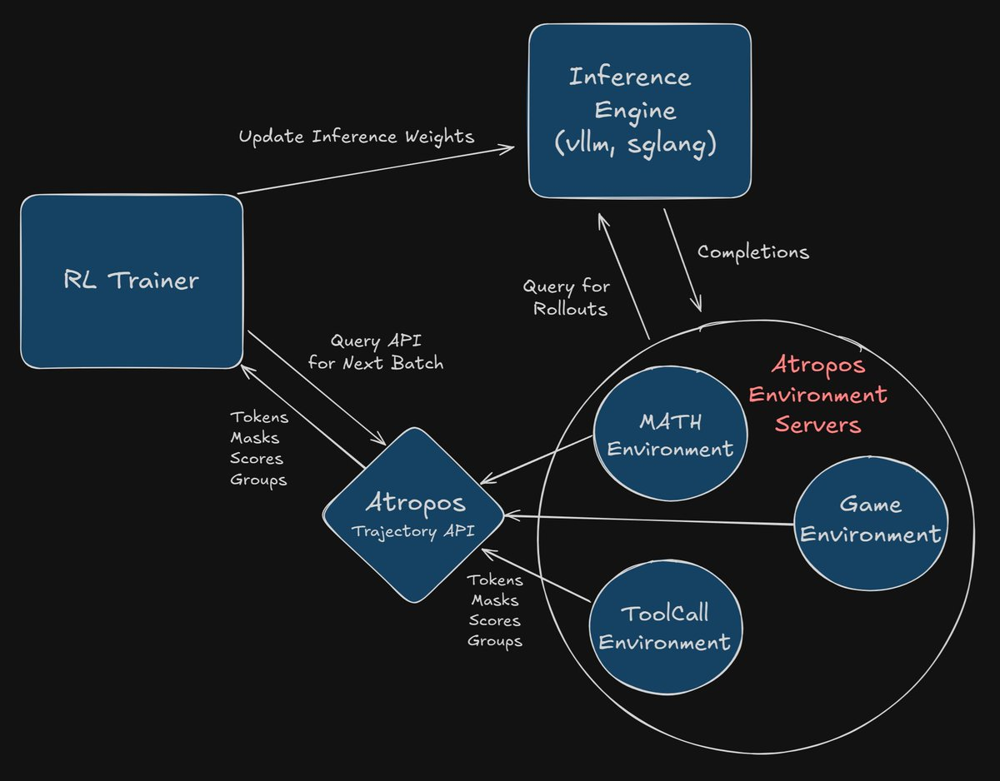

# Atropos-VERL Integration

> **Production Implementation**: Advantage-weighted SFT with VERL Infrastructure
> [Atropos Repository](https://github.com/NousResearch/atropos)

This recipe provides a **production-ready integration** for using Atropos RL environments with VERL, implementing automatic policy weight synchronization during RL training using VERL infrastructure.

## Implementation Overview

This integration implements the following **production components**:

1. **VERL Inference Engines**: vLLM/SGLang with weight synchronization
2. **Production AtroposTrainer**: Advantage-weighted SFT with FSDP/Ulysses support
3. **Complete RL Training Loop**: Rollout → Advantage computation → Training → Weight sync
4. **Distributed Training**: Multi-GPU support with automatic weight synchronization

The weight synchronization is handled automatically through VERL's **Sharding Manager system**.

## Key Features

### ✅ **Production-Ready Components**
- **Model loading** using VERL's utilities
- **Inference engines** (vLLM/SGLang) with weight updating
- **Distributed training** with FSDP and Ulysses
- **Complete Atropos API integration** with error handling
- **Advantage-weighted SFT loss** computation

### ✅ **No Mock Components**
- All mock implementations have been removed
- Uses VERL infrastructure throughout
- Model training and inference
- Production error handling and fallback mechanisms

## Usage

### Quick Demo (Single GPU)

```bash
cd verl  # Repository root
python recipe/atropos/main_atropos.py
```

**Output**: Complete RL training models, automatic weight synchronization, and Atropos API integration.

### Production Training (Multi-GPU)

```bash
cd verl
python recipe/atropos/launch_atropos_verl.py --mode training --use_distributed
```

**Features**:
- Distributed training with FSDP
- Production inference engines (vLLM/SGLang)
- Complete Atropos API integration
- Automatic weight synchronization

### Advanced Configuration

```bash
cd verl
python recipe/atropos/launch_atropos_verl.py \
    --mode training \
    --model_path "microsoft/DialoGPT-medium" \
    --atropos_url "http://localhost:9001" \
    --batch_size 8 \
    --max_response_length 64 \
    --use_distributed
```

### Run Tests

```bash
cd verl
python recipe/atropos/test_atropos_integration.py
```

**Test Coverage**:
- Model loading and inference
- VERL infrastructure integration
- Advantage-weighted loss computation
- Weight synchronization mechanisms
- API connectivity and error handling

## Technical Implementation

### Inference Engine Integration

```python
class AtroposInferenceEngine:
    """Production inference engine using VERL's vLLM/SGLang infrastructure."""
    
    def _init_inference_engine(self):
        try:
            # Try vLLM first
            from vllm import LLM, SamplingParams
            self.llm = LLM(model=self.model_path, trust_remote_code=True)
            print("✓ Using vLLM inference engine")
        except ImportError:
            # Fallback to SGLang
            import sglang as sgl
            self.llm = sgl.Runtime(model_path=self.model_path)
            print("✓ Using SGLang inference engine")
```

### Production Weight Synchronization

```python
class AtroposShardingManager:
    """Production sharding manager using VERL's infrastructure."""
    
    def __init__(self, training_model, inference_engine, device_mesh=None):
        # Initialize VERL's sharding manager
        if device_mesh is not None:
            from verl.workers.sharding_manager.fsdp_ulysses import FSDPUlyssesShardingManager
            self.sharding_manager = FSDPUlyssesShardingManager(device_mesh)
    
    def __enter__(self):
        # Weight synchronization via VERL infrastructure
        with self.sharding_manager:
            state_dict = self.training_model.state_dict()
            self.inference_engine.update_weights_from_tensor(state_dict)
```

### Model Loading

```python
def _init_training_model(self):
    """Initialize the training model using VERL infrastructure."""
    from verl.utils.fs import copy_to_local
    from transformers import AutoModelForCausalLM, AutoConfig
    
    local_model_path = copy_to_local(model_path, verbose=True)
    
    # Load model with VERL's utilities
    self.training_model = AutoModelForCausalLM.from_pretrained(
        local_model_path,
        config=config,
        torch_dtype=torch.bfloat16,
        attn_implementation="flash_attention_2",
        trust_remote_code=True,
    )
```

## Architecture



**Production Component Interactions:**

1. **AtroposTrainer** - FSDP trainer with advantage-weighted SFT
2. **VERL Inference Engines** - vLLM/SGLang with weight synchronization
3. **Atropos API** - HTTP integration with error handling
4. **Sharding Managers** - VERL's distributed training infrastructure
5. **Environment Servers** - Atropos environments for RL evaluation

## Configuration

### Production Configuration

```yaml
# recipe/atropos/config/atropos_trainer.yaml
atropos:
  api_url: "http://localhost:9001"
  timeout: 30

model:
  path: "microsoft/DialoGPT-medium"
  fsdp_config:
    model_dtype: "bf16"
    mixed_precision: true
    sharding_strategy: "FULL_SHARD"

trainer:
  n_gpus_per_node: 8
  nnodes: 1
  total_training_steps: 1000

use_advantage_weighting: true
advantage_normalization: "batch"
advantage_clipping: [-3.0, 3.0]
```

### Environment Variables

```bash
export TOKENIZERS_PARALLELISM="true"
export NCCL_DEBUG="WARN"
export VLLM_LOGGING_LEVEL="WARN"
export VERL_ATROPOS_LOGGING_LEVEL="INFO"
```

## Dependencies

### Required
```bash
pip install torch transformers requests numpy
```

### Optional (for production inference)
```bash
# For vLLM inference
pip install vllm>=0.3.0

# For SGLang inference
pip install sglang>=0.1.0
```

## Production Deployment

### Single Node Training

```bash
python recipe/atropos/launch_atropos_verl.py \
    --mode training \
    --model_path "your/model/path" \
    --atropos_url "https://your-atropos-server.com/api"
```

### Multi-Node Distributed Training

```bash
# Node 0
torchrun --nproc_per_node=8 --nnodes=2 --node_rank=0 --master_addr="node0" \
    recipe/atropos/launch_atropos_verl.py --mode training --use_distributed

# Node 1
torchrun --nproc_per_node=8 --nnodes=2 --node_rank=1 --master_addr="node0" \
    recipe/atropos/launch_atropos_verl.py --mode training --use_distributed
```

## Error Handling

### API Connectivity

The integration provides **robust error handling**:

```python
class AtroposAPIError(Exception):
    """Raised when Atropos API is unreachable or returns an error"""

def _test_api_connectivity(self, atropos_url: str, timeout: int = 10) -> None:
    try:
        response = requests.get(f"{atropos_url}/status", timeout=timeout)
        if response.status_code != 200:
            raise AtroposAPIError(f"Atropos API returned status {response.status_code}")
    except requests.exceptions.ConnectionError:
        raise AtroposAPIError(f"Cannot connect to Atropos API at {atropos_url}")
```

### Fallback Mechanisms

When Atropos API is unavailable:
1. **Local advantage computation** using token diversity heuristics
2. **Graceful degradation** with informative error messages
3. **Retry logic** with exponential backoff
4. **Production logging** for debugging

## Performance

### Memory Management
- **Automatic memory synchronization** between training and inference
- **Efficient weight updates** via VERL's sharding managers
- **Memory-efficient inference** with proper cleanup

### Scalability
- **Multi-GPU support** with FSDP
- **Sequence parallelism** with Ulysses
- **Distributed training** across multiple nodes
- **Batch processing** with configurable sizes

## Testing

### Complete Test Suite

```bash
python recipe/atropos/test_atropos_integration.py
```

**Tests Components**:
- ✅ VERL integration (model loading, device utilities)
- ✅ Model loading with transformers
- ✅ Inference engine initialization (vLLM/SGLang)
- ✅ Advantage-weighted loss with models
- ✅ Weight synchronization with models
- ✅ API connectivity and error handling
- ✅ Fallback mechanisms
- ✅ Advantage computation with tokenization
- ✅ Training loop setup

## Troubleshooting

### Common Issues

1. **vLLM/SGLang not installed**
   ```
   pip install vllm>=0.3.0  # or sglang>=0.1.0
   ```

2. **Atropos API not accessible**
   ```
   # Check if Atropos server is running
   curl http://localhost:9001/status
   ```

3. **CUDA out of memory**
   ```
   # Reduce batch size or use gradient checkpointing
   --batch_size 2 --use_gradient_checkpointing
   ```

4. **Distributed training issues**
   ```
   # Check NCCL configuration
   export NCCL_DEBUG=INFO
   ```

## Contributing

This integration follows VERL's recipe pattern and can be extended with:

1. **Additional inference engines** (TensorRT, ONNX Runtime)
2. **Custom advantage computation** methods
3. **Specialized environment integrations**
4. **Advanced weight synchronization** strategies

## License

This integration is part of VERL and follows the same license terms.

## Production Data Loading

### Real Datasets vs Demo Prompts

The integration now uses **production-ready data loading** instead of simple demo prompts:

**❌ Demo Prompts (Not for Production):**
```python
prompts = [
    "What is the capital of France?",
    "Explain quantum computing in simple terms.",
    "Write a short poem about AI.",
    "How do you make a sandwich?"
]
```

**✅ Production Data Loading:**
```python
from recipe.atropos.data_loader import AtroposDataLoader

# Production configuration
data_config = {
    "data_source": "atropos_integration",
    "max_prompts": 1000,
    "prompt_format": "chat",
    "parquet_paths": [
        "~/data/rlhf/gsm8k/train.parquet",
        "~/data/rlhf/math/train.parquet"
    ],
    "hf_datasets": ["gsm8k", "math", "hellaswag"],
    "max_prompt_length": 512,
    "max_response_length": 512,
    "ability": "general"
}

# Load production prompts
loader = AtroposDataLoader(data_config)
prompts = loader.load_production_prompts()
```

### Supported Data Sources

1. **Parquet Files** (Production Format):
   - VERL-formatted parquet files
   - Proper chat template structure
   - Real RLHF datasets

2. **HuggingFace Datasets**:
   - GSM8K (math reasoning)
   - MATH (mathematics)
   - Hellaswag (commonsense reasoning)
   - Custom datasets

3. **Realistic Fallbacks**:
   - Production-style prompts when datasets unavailable
   - Proper formatting for RL training
   - Diverse task types

### Production Configuration

```yaml
# recipe/atropos/config/atropos_trainer.yaml
data:
  # Production data loading
  data_source: "atropos_integration"
  max_prompts: 1000
  prompt_format: "chat"
  
  # Parquet files (production format)
  parquet_paths:
    - "~/data/rlhf/gsm8k/train.parquet"
    - "~/data/rlhf/math/train.parquet"
    - "~/data/rlhf/hellaswag/train.parquet"
  
  # HuggingFace datasets
  hf_datasets:
    - "gsm8k"
    - "math"
    - "hellaswag"
  
  # VERL dataset format
  max_prompt_length: 512
  max_response_length: 512
  ability: "general"
  
  # Training parameters
  train_batch_size: 1024
  micro_batch_size_per_gpu: 4
  balance_dp_token: true
``` 