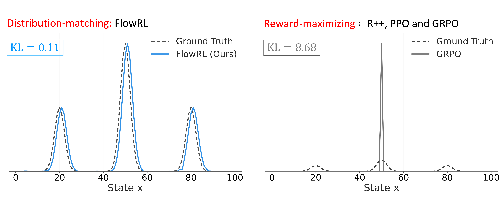

<h1 align="center" style="color:#1976D2; font-size:42px; font-weight:bold; margin-bottom:0;">
  FlowRL
</h1>

<p align="center" style="color:#42A5F5; font-size:16px; margin-top:0;">
  Matching Reward Distributions via Flow Balance
</p>
<p align="center" style="color:#42A5F5; font-size:15px; margin-top:4px;">
  <a href="https://arxiv.org/abs/2509.15207" target="_blank">📄 arXiv Paper</a> |
  <a href="https://huggingface.co/papers/2509.15207" target="_blank">🤗 HF Daily</a>
</p>

<p align="center">
  
</p>

## FlowRL Objective:

$$
\mathcal{L}_{\text{FlowRL}} = w \cdot \left( \log Z_{\phi}(x) + \frac{1}{|y|} \log \pi_{\theta}(y \mid x) - \beta \hat{r}(x, y) - \frac{1}{|y|} \log \pi_{\text{ref}}(y \mid x) \right)^2
$$

FlowRL is a flow-balanced reinforcement learning method that matches full reward distributions instead of maximizing rewards, promoting diverse exploration and generalizable reasoning trajectories in LLMs.

## 🚀 Implementation Guide

- ⚙️ If you want to implement by yourself, we provide a simple guideline to apply FlowRL in your code: [FlowRL Implementation Guide](FLOWRL_SIMPLE_GUIDE.md).

- 📢 TODO: We are preparing to contribute FlowRL implementation to official repositories [veRL](https://github.com/volcengine/verl)
 and [SLIME](https://github.com/THUDM/slime). Stay tuned.


## Quick Start

### Installation

Install [veRL](https://github.com/volcengine/verl) first before using FlowRL.

### Data Preparation

```bash
# Option 1: Download our pre-processed datasets directly.
bash preprocess/down_load_dataset.sh
# Move data to default directory
mv data/xuekai/flowrl-data-collection/math_data data/math_data
mv data/xuekai/flowrl-data-collection/code_data data/code_data
```

```bash
# Option 2: Process Data from Source. 
Process data from original sources. 
```
For detailed processing instructions, see [data/README.md](data/README.md).

### Model Preparation

For Math Tasks: `Qwen/Qwen2.5-7B` (default in script) ; `Qwen/Qwen2.5-32B`

For Code Tasks: `deepseek-ai/DeepSeek-R1-Distill-Qwen-7B`

```bash
# Download default model (Qwen2.5-7B for math)
bash preprocess/down_load_model.sh

# For other models, modify MODEL_NAME in the script before running
```

### Training

```bash
cd verl_FlowRL

# For 7B math training
bash command/training/math/flowrl_7B_math.sh

# For 32B math training
bash command/training/math/flowrl_32B_math.sh

# For 7B code training
bash command/training/code/flowrl_7B_code.sh
```

### Testing

```bash
cd verl_Test

# First merge the model
bash command/eval/merge_model.sh

# For math testing
bash command/eval/math/flowrl_math_test.sh

# For code testing
bash command/eval/code/flowrl_code_test.sh
```


## Citation

If you think this repo helps you, please kindly consider citing our paper:

```bibtex
@article{zhu2025flowrl,
  title={FlowRL: Matching Reward Distributions for LLM Reasoning},
  author={Zhu, Xuekai and Cheng, Daixuan and Zhang, Dinghuai and Li, Hengli and Zhang, Kaiyan and Jiang, Che and Sun, Youbang and Hua, Ermo and Zuo, Yuxin and Lv, Xingtai and others},
  journal={arXiv preprint arXiv:2509.15207},
  year={2025}
}
```
