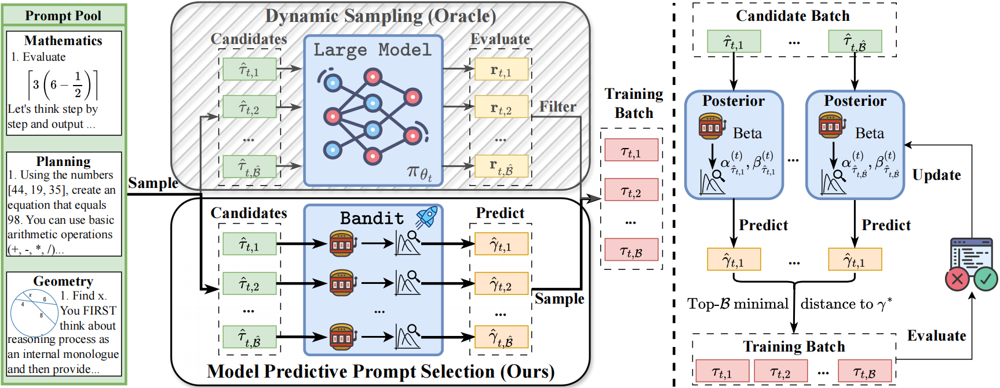

<p align="center">
<h1 align="center">MoPPS: Model Predictive Prompt Selection</h1>
<div align="center">

[](https://arxiv.org/abs/2507.04632)
[](https://www.thuidm.com/)
[](https://github.com/thu-rllab/MoPPS)

</div>

<p align="center">
  <strong>A Bayesian framework for online predicting prompt difficulty to accelerate RL finetuning of Large Reasoning Models</strong>
</p>

<p align="center">
  <a href="#-quickstart">Quickstart</a> •
  <a href="#-integration-guide">Integration</a> •
  <a href="#-citation">Citation</a>
</p>




<p align="center">
  👉 <strong>Check out our <a href="https://github.com/thu-rllab/MoPPS">GitHub Repository</a> for code and updates!</strong> 👈
</p>

---
## 🚀 Quickstart

### Step 1: Prepare Data
```bash
# Countdown dataset preparation
python recipe/mopps/data_preprocess/countdown.py --local_dir='./data/countdown3to4'
python recipe/mopps/data_preprocess/countdown4.py --local_dir='./data/countdown4'
```

### Step 2: Download Pretrained Models
```bash
# Example: Qwen2.5-3B
huggingface-cli download --resume-download Qwen/Qwen2.5-3B --local-dir models/Qwen2.5-3B
```

### Step 3: Training
```bash
# Countdown task with Qwen2.5-3B
bash recipe/mopps/scripts/countdown/cd_verl_3b_topk_noinit.sh
```

---


## 📥 Integration Guide
**Model Predictive Prompt Selection (MoPPS)** is a Bayesian risk-predictive framework that online estimates prompt difficulty without requiring costly LLM interactions.
Technically, MoPPS models each prompt's success rate as a latent variable, performs streaming Bayesian inference, and employs posterior sampling in a constructed multi-armed bandit machine, enabling sample efficient and adaptive prompt selection. 


The main implementation is in [`mopps.py`](mopps.py), featuring two key operations:

### 1️⃣ `train`: Bayesian Inference towards Prompt Success Rate

We formulate online prompt selection as a sequential decision-making problem and solve it with a dynamic Bernoulli bandit machine:

**Recursive Bayesian Update with Temporal Discounting:**

$$
\alpha^{t'}_{\tau} = \lambda \cdot \alpha^{t}_{\tau} + (1 - \lambda) \cdot \alpha_{\tau}^{0} + s^t_\tau
$$

$$
\beta^{t'}_{\tau} = \lambda \cdot \beta^{t}_{\tau} + (1 - \lambda) \cdot \beta_{\tau}^{0} + k - s^t_\tau
$$

**Implementation:**

```python
def train(self, batch_candidates_dict, y):
    if self.no_update:
        return None, None, None
    
    indices = batch_candidates_dict['index']
    for idx, s in zip(indices, y):
        idx = str(idx)
        n_rollout = self.args.actor_rollout_ref.rollout.n if self.args.actor_rollout_ref.rollout.n > 1 else 8
        
        self.alpha[idx] = (self.alpha[idx] * self.decay_ratio + 
                          self.prior_alpha * (1 - self.decay_ratio) + 
                          s * n_rollout)
        
        self.beta[idx] = (self.beta[idx] * self.decay_ratio + 
                         self.prior_beta * (1 - self.decay_ratio) + 
                         (1 - s) * n_rollout)
    
    return None, None, None
```

### 2️⃣ `sample_batch`: Active Prompt Selection

The posterior distribution's estimate of a prompt's success rate correlates strongly with ground truth. We adopt **Thompson Sampling** for its natural exploration-exploitation trade-off:

**Fast Success Rate Estimates from Approximate Posteriors:**

$$
\hat{\gamma}^t_\tau \sim \mathrm{Beta}(\alpha_\tau^{t}, \beta_\tau^{t}) \quad \forall\tau\in\mathcal{T}_{t}^{\hat{\mathcal{B}}}
$$

```python
sampled_r = np.random.beta(local_alpha, local_beta)
```

**Top-B Selection Strategy:**

$$
\mathcal{T}_t^\mathcal{B} = \text{Top-}\mathcal{B}( \{ \tau \in \mathcal{T}_{t}^{\hat{\mathcal{B}}} | -\lVert \hat{\gamma}^t_\tau - \gamma^* \rVert_2^2 \} )
$$

```python
distances = (sampled_r - target_mu) ** 2
sampled_index = np.argsort(distances)[:self.real_batch_size]
```

> 💡 **Note:** MoPPS can easily integrate with alternative selection strategies, e.g., threshold filtering.

### 🔌 Easy Integration

MoPPS can be seamlessly integrated into your RL training pipeline.

**Key Integration Points:**
- 📊 **Before rollout**: Call `sample_batch()` to select prompts
- 🔄 **After reward**: Call `train()` to update Bayesian posteriors

```python
for epoch in range(self.config.trainer.total_epochs):
    for batch_dict in self.train_dataloader:
        # Step 1: Active pre-rollout prompt selection
        if self.task_sampler is not None:
            batch_dict, acquisition_score = self.task_sampler.sample_batch(batch_dict)
        
        # ... (rollout generation & evaluation)

        # Step 2: Update posterior with observed success rates
        ts_loss, ts_recon_loss, ts_kl_loss = self.task_sampler.train(
            batch_dict, 
            success_rate
        )
        # ... (RL training)
```

---


## 📚 Citation

If you find this work useful, please cite:

```bibtex
@article{qu2025can,
  title={Can Prompt Difficulty be Online Predicted for Accelerating RL Finetuning of Reasoning Models?},
  author={Qu, Yun and Wang, Qi and Mao, Yixiu and Hu, Vincent Tao and Ommer, Bj{\"o}rn and Ji, Xiangyang},
  journal={arXiv preprint arXiv:2507.04632},
  year={2025}
}
```

### Related Work

This work is inspired by:

```bibtex
@article{wang2025model,
  title={Model predictive task sampling for efficient and robust adaptation},
  author={Wang, Qi and Xiao, Zehao and Mao, Yixiu and Qu, Yun and Shen, Jiayi and Lv, Yiqin and Ji, Xiangyang},
  journal={arXiv preprint arXiv:2501.11039},
  year={2025}
}

@inproceedings{qu2025fast,
  title={Fast and Robust: Task Sampling with Posterior and Diversity Synergies for Adaptive Decision-Makers in Randomized Environments},
  author={Qu, Yun and Wang, Cheems and Mao, Yixiu and Lv, Yiqin and Ji, Xiangyang},
  booktitle={Forty-second International Conference on Machine Learning},
  year={2025}
}
```
