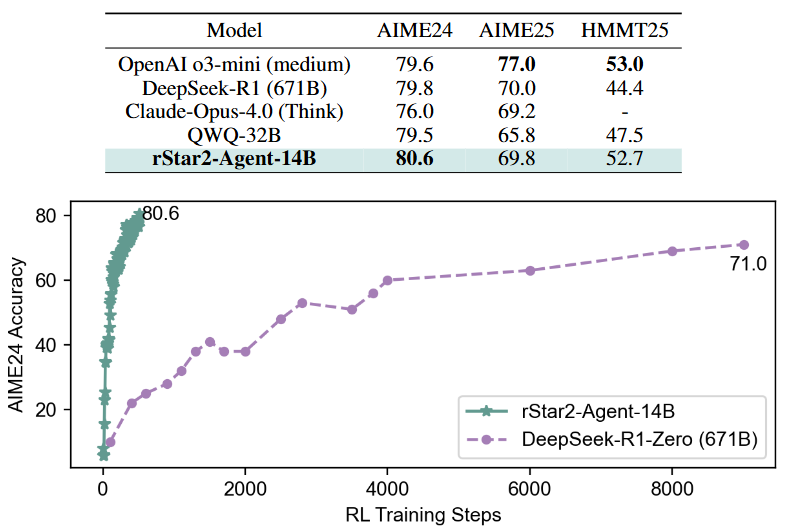

<h1 align="center">
<br>
rStar2-Agent
</h1>

<p align="center">
📃 <a href="https://huggingface.co/papers/2508.20722" target="_blank">[Paper]</a> 
</p>

Repo for "[rStar2-Agent: Agentic Reasoning Technical Report](https://huggingface.co/papers/2508.20722)".

Authors: Ning Shang\*, Yifei Liu\*, Yi Zhu\*, Li Lyna Zhang\*†, Weijiang Xu, Xinyu Guan, Buze Zhang, Bingcheng Dong, Xudong Zhou, Bowen Zhang, Ying Xin, Ziming Miao, Scarlett Li, Fan Yang, Mao Yang†

<p align="center">
    
        <br>
    <em>Figure 1: rStar2-Agent-14B reaches frontier-level math reasoning in just 510 RL training step</em>
</p>

## News 

- **[07/15/2025]** Our rStar-Coder [paper](https://arxiv.org/abs/2505.21297) and [dataset](https://huggingface.co/datasets/microsoft/rStar-Coder) are released. We introduce a large-scale, verified dataset of 418K competition-level code problems with **test cases** of varying difficulty, enabling small LLMs (1.5B-14B) to achieve frontier-level code reasoning performance.
- **[02/10/2025]** We are hiring interns! If you are interested in improving LLM reasoning, please send your CV to lzhani@microsoft.com.
- **[01/21/2025]** rStar-Math code has been open-sourced. 
- **[01/09/2025]** rStar-Math paper is released: https://huggingface.co/papers/2501.04519.

Note: Our prior work [Mutual Reasoning Makes Smaller LLMs Stronger Problem-Solvers](https://huggingface.co/papers/2408.06195) is open-sourced on the [rStar-mutualreasoning](https://github.com/microsoft/rStar/tree/rStar-mutualreasoning) branch.

Note: Our prior work [rStar-Math: Small LLMs Can Master Math Reasoning with Self-Evolved Deep Thinking](https://huggingface.co/papers/2501.04519) is open-sourced on the [rStar-math](https://github.com/microsoft/rStar/tree/rStar-math) branch.

## Contents
- [Introduction](#Introduction)
- [Try rStar2-Agent with Tool Calling](#Try-rStar2-Agent-with-Tool-Calling)
- [Evaluation](#Evaluation)
- [rStar2-Agent RL Training](#rStar2-Agent-RL-Training)
- [Citation](#Citation)

## Introduction
We introduce rStar2-Agent, a 14B math reasoning model that thinks smarter rather than merely longer, achieving performance comparable to 671B DeepSeek-R1 through pure agentic reinforcement learning. The model plans, reasons, and autonomously uses coding tools to efficiently explore, verify, and reflect for more complex problem-solving. This capability relies on three key innovations: (i) GRPO-RoC, an effective agentic reinforcement learning algorithm with a novel Resample-on-Correct rollout strategy that optimizes coding tool usage and enables shorter, smarter reasoning by selectively retaining higher-quality positive trajectories while preserving all failure cases; (ii) a scalable and efficient RL infrastructure that supports high-throughput tool call execution and mitigates the high costs of agentic RL rollout, enabling efficient training on limited GPU resources (64 MI300X GPUs); (iii) an agent training recipe that starts with non-reasoning SFT and proceeds through multi-stage RL with concise maximum response lengths per stage and increasing dataset difficulty. To this end, rStar2-Agent boosts a pre-trained 14B model to state-of-the-art levels in only 510 RL steps within one week, achieving 80.6% and 69.8% average pass@1 on AIME24 and AIME25, surpassing DeepSeek-R1 (671B) with shorter responses. Beyond mathematics, rStar2-Agent-14B also demonstrates strong generalization to alignment, scientific reasoning, and agentic tool-use tasks.

## Try rStar2-Agent with Tool Calling

### Installation

#### Option 1: Manual Installation

```bash
# install code judge
sudo apt-get update -y && sudo apt-get install redis -y
git clone https://github.com/0xWJ/code-judge
pip install -r code-judge/requirements.txt
pip install -e code-judge

# install rstar2_agent requirements
pip install -r requirements.txt
```

#### Option 2: Automated Installation

```bash
bash install.sh
```

### Code Judge Server Setup

> ⚠️ **Security Warning**: Code Judge executes arbitrary code. Always deploy in an isolated environment (preferably Docker) and never expose to external networks.

The rStar2-Agent uses Code Judge as a tool call server to execute model-generated Python code.

#### 1. Start Redis Server

```bash
sudo apt-get update -y && sudo apt-get install redis -y
redis-server --daemonize yes --protected-mode no --bind 0.0.0.0
```

#### 2. Launch Code Judge Server

```bash
# Start the main server (master node only)
# Environment variables can be configured as per: https://github.com/0xWJ/code-judge/blob/main/app/config.py
# Replace $WORKSPACE and $MASTER_ADDR with your actual paths

tmux new-session -d -s server \
  'cd $WORKSPACE/code-judge && \
   MAX_EXECUTION_TIME=4 \
   REDIS_URI="redis://$MASTER_ADDR:6379" \
   RUN_WORKERS=0 \
   uvicorn app.main:app --host 0.0.0.0 --port 8088 --workers 16 \
   2>&1 | tee server.log'
```

#### 3. Start Code Judge Workers

```bash
# Launch workers (can be deployed on multiple nodes for increased parallelism)
# Adjust MAX_WORKERS based on your CPU count per node

tmux new-session -d -s worker \
  'cd $WORKSPACE/code-judge && \
   MAX_EXECUTION_TIME=4 \
   REDIS_URI="redis://$MASTER_ADDR:6379" \
   MAX_WORKERS=64 \
   python run_workers.py \
   2>&1 | tee worker.log'
```

### Launch the VLLM Server

First, start the VLLM server:

```bash
vllm serve /path/to/your/model \
    --host 0.0.0.0 \
    --port 8000 \
    --enable-auto-tool-choice \
    --tool-call-parser hermes
```

Replace `/path/to/your/model` with the actual path to your downloaded model.

### Verify Server Status

Check if the server is running properly:

```bash
curl http://localhost:8000/v1/models
```

### Run Interactive Chat with Tool Calling

Use the provided script to interact with your model:

```bash
python examples/chat_with_tool_call.py \
    --model /path/to/your/model \
    --prompt "Solve the system of equations: 2x + 3y = 7, x - y = 1" \
    --max_tokens 8192
```

### Script Options

The `examples/chat_with_tool_call.py` script supports the following arguments:

- `--model`: Path to your model
- `--prompt`: Input prompt for the model
- `--max_tokens`: Maximum number of tokens to generate

## Evaluation

### Environment Setup

Please view [Installation](#Installation) and [Code Judge Server Setup](#Code-Judge-Server-Setup).

### Run Evaluation Script

We evaluate following mathematical reasoning benchmarks:

- **AIME 2024/2025 (American Invitational Mathematics Examination)**: High-school level competition mathematics
- **MATH500**: A subset of the MATH dataset containing 500 challenging problems

```bash
MODEL_PATH=/path/to/your/model bash examples/aime_eval.sh
MODEL_PATH=/path/to/your/model bash examples/math500_eval.sh
```

## rStar2-Agent RL Training

A comprehensive reinforcement learning training framework for the rStar2-Agent, built on [Verl](https://github.com/volcengine/verl) and [Code Judge](https://github.com/0xWJ/code-judge). This framework enables training models after instruction-following supervised fine-tuning (SFT).

### Environment Setup

Please view [Installation](#Installation) and [Code Judge Server Setup](#Code-Judge-Server-Setup).

### Data Preparation

This example uses:
- **Training Dataset**: DAPO-17k (English subset)
- **Test Dataset**: AIME24

```bash
# Process AIME 2024 dataset
python data_preprocess/aime2024_rstar2_agent_loop.py

# Process DAPO dataset
python data_preprocess/dapo_rstar2_agent_loop.py
```

### Model Setup

Download the base model (Qwen3-14B-Base):

```bash
huggingface-cli download Qwen/Qwen3-14B-Base --local-dir $HOME/models/Qwen3-14B-Base
```

> **Note**: The base model requires instruction-following SFT before RL training for optimal performance.

### Training

#### Basic Training

Run the training script (for 8x A100/H100 GPUs):

```bash
bash examples/run_qwen3-14b_rstar2_agent_weave.sh
```

> Adjust configuration parameters based on your hardware environment.

### Configuration

#### Data Augmentation Settings

The framework supports various sampling strategies to improve training efficiency:

```bash
# Global Settings
augmentation.do_down_sampling=True                                   # Enable down sampling
augmentation.down_sampling_config.down_sample_to_n=16                # Target number of traces per data point

# Sampling Strategies
augmentation.down_sampling_config.reject_equal_reward=True           # Enable reject sampling for equal rewards
augmentation.down_sampling_config.roc_error_ratio=True               # Resample correct traces by tool call error ratio
augmentation.down_sampling_config.roc_answer_format=True             # Resample correct traces by answer format

# Minimum Trace Requirements
augmentation.down_sampling_config.min_zero_reward_trace_num=2        # Minimum negative traces to retain
augmentation.down_sampling_config.min_non_zero_reward_trace_num=2    # Minimum positive traces to retain
```

### Important Note

rStar2-Agent was originally training based on VERL v0.2 with our custom multi-turn tool calling training framework. The current training framework released here has been migrated to VERL v0.5 to ensure compatibility with the latest community standards. While this release framework hasn't been used to train a complete model yet, we have verified that the first 50 training steps show minimal differences between our original and migrated frameworks, maintaining the core functionality of our proven training approach.

Although our original framework includes additional advanced features such as rollout request load balance scheduler, we chose to migrate to the latest VERL version to maintain community compatibility and facilitate easier customization by users. This approach ensures you can benefit from ongoing VERL improvements and easily integrate with the latest open-source developments. We also consider migrating all features to the current version in the future.

If you encounter any issues during usage or need assistance with the training framework, please contact us.

### Troubleshooting

#### Common Issues

1. **Redis Connection Errors**: Ensure Redis is running and accessible at the specified address
2. **GPU Memory Issues**: Adjust batch sizes and model parameters for your hardware
3. **Code Judge Timeouts**: Increase `MAX_EXECUTION_TIME` for complex computations
4. **Worker Scaling**: Adjust `MAX_WORKERS` based on available CPU cores

#### Log Locations

- Server logs: `server.log` in the code-judge directory
- Worker logs: `worker.log` in the code-judge directory
- Training logs: Check your training script output directory

---


## Citation
If you find this repo useful for your research, please consider citing the paper
```
@misc{shang2025rstar2agentagenticreasoningtechnical,
      title={rStar2-Agent: Agentic Reasoning Technical Report}, 
      author={Ning Shang and Yifei Liu and Yi Zhu and Li Lyna Zhang and Weijiang Xu and Xinyu Guan and Buze Zhang and Bingcheng Dong and Xudong Zhou and Bowen Zhang and Ying Xin and Ziming Miao and Scarlett Li and Fan Yang and Mao Yang},
      year={2025},
      eprint={2508.20722},
      archivePrefix={arXiv},
      primaryClass={cs.CL},
      url={https://arxiv.org/abs/2508.20722}, 
}
```
